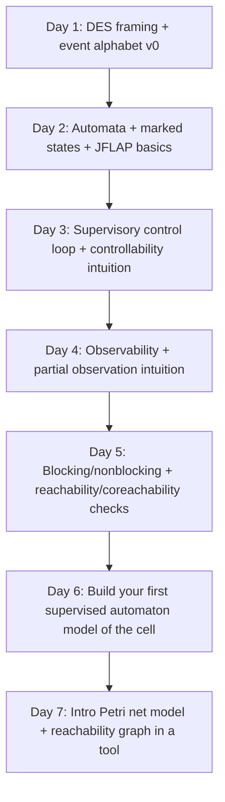
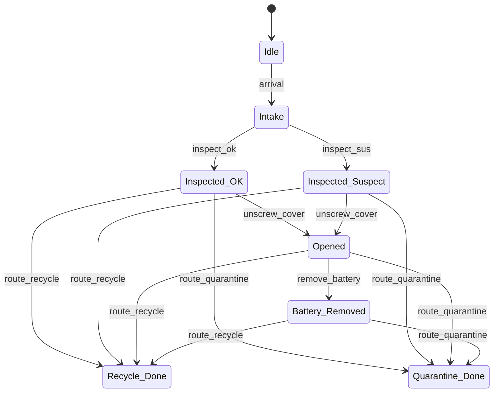
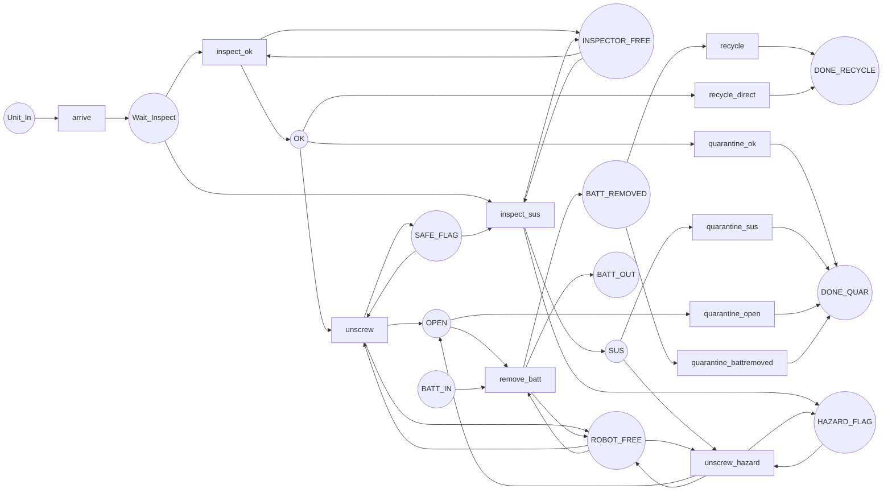

# Week One Preparation Pack for Discrete Event Systems and Supervisory Control

## Executive summary

Your proposal work hinges on converting a real demanufacturing cell into **(i) a finite, auditable DES model** and **(ii) a supervisor that can *guarantee* safety (avoid forbidden situations) while staying live/nonblocking (the system can still finish jobs)**. fileciteturn0file0

This Week One pack gives you (a) a **curated set of freely available, authoritative notes/papers**, (b) a **day-by-day plan (2–4 h/day)** with exact sections/pages, (c) **two fully worked demanufacturing-cell mini-models** (one automaton + one Petri net) including forbidden situations, supervisor rules, and reachability/nonblocking analysis, and (d) **tooling links + “how-to”** so you can reproduce the examples in software.

By the end of the week, you will have three artefacts you can directly reuse for the proposal execution:  
1) an initial **event alphabet and controllability/observability table** for your cell,  
2) a **first plant + safety specs** in automata and Petri-net form,  
3) a **supervisor rule set** plus a documented **reachability/nonblocking check**.

## Prioritised free online study resources

### Essentials and recommended resources

The table is ordered to match the Week One schedule later. All items are freely accessible online.

| Priority | Resource | What it covers | Why it is useful for modelling a demanufacturing cell |
|---|---|---|---|
| Essential | Course notes: *Discrete Event and Hybrid Systems* by entity["people","Jörg Raisch","tu berlin control"] (entity["organization","Technische Universität Berlin","berlin, germany"]) | Petri nets (reachability, deadlock), finite automata with marked states, blocking vs nonblocking, and an SCT “manufacturing cell” worked example in automata form. citeturn4view0turn12view0turn12view3 | One self-contained PDF that bridges the exact modelling moves you will do: **events → automata/Petri nets → blocking/nonblocking analysis → supervisor construction**. The manufacturing-cell example is especially transferable to demanufacturing because it formalises *resource handshakes* and *uncontrollable events* typical of industrial equipment. citeturn12view0turn12view1 |
| Essential | EOLSS chapter: *Discrete Event Systems* by entity["people","Christos G. Cassandras","des researcher"] | Definitions of DES, contrasts with time-driven systems, and a modelling overview including automata and Petri nets. citeturn4view3 | A compact “big picture” framing you can cite when motivating why demanufacturing is naturally event-driven (arrival, inspection results, routing decisions, machine completion/faults). citeturn4view3 |
| Essential | EOLSS chapter: *Supervisory Control of Discrete Event Systems* by entity["people","Stéphane Lafortune","des researcher"] | A clean introduction to SCT, including the meaning of **uncontrollable vs unobservable events**, and synthesis ideas (supremal controllable sublanguage; nonblocking case; partial observation). citeturn4view2 | Direct relevance to your “allowed actions / forbidden situations / guaranteed safety” requirement: it explicitly connects existence of a supervisor to **controllability** and **observability** conditions and discusses the nonblocking variant. citeturn4view2 |
| Essential | Encyclopaedia chapter (PDF): *Supervisory Control of Discrete-Event Systems* (2020) by entity["people","Kai Cai","des control theorist"] and entity["people","W. M. Wonham","des supervisory control"] | RW/SCT base model, **nonblocking definition**, controllability properties, and partial-observation notes (incl. why observability is tricky and why normality/relative observability are used). citeturn13view0turn13view2turn13view3 | Short, rigorous, and modern: ideal for quickly locking down definitions (especially **nonblocking**) and for knowing what happens when some events in your cell are not observable (hidden damage, internal fasteners). citeturn13view2turn13view3 |
| Essential | Classic tutorial paper: *The Control of Discrete Event Systems* (1989) by entity["people","P. J. Ramadge","des researcher"] and entity["people","W. M. Wonham","des supervisory control"] | Foundational DES control perspective; explicitly names controllability/observability and motivates modular/hierarchical directions. citeturn7view1turn7view2 | This is the original “why” behind your Week One pillar. Use it to ground proposal language in the canonical DES control framing and to justify why your cell should be modelled via event sequences and admissible behaviours. citeturn7view1turn7view2 |
| Essential | entity["organization","MIT OpenCourseWare","cambridge, ma, us"] 18.404J Lecture Notes (PDF): Lecture 1 + Lecture 2 by entity["people","Michael Sipser","theory of computation prof"] | Fast, clear DFA/NFA/regular language foundation (Lecture 1) and nondeterminism + NFA→DFA intuition + regular-expression connections (Lecture 2). citeturn14search0turn6view2 | SCT uses automata/regular languages as its “plant/specification” substrate. These notes give you the minimum automata theory you need without a textbook dependency. citeturn14search0turn6view2 |
| Essential | Tutorial paper: *Petri Nets: Properties, Analysis and Applications* (1989) by entity["people","Tadao Murata","petri net researcher"] | Petri net primitives, behavioural/structural properties, classic analysis methods, and reachability discussion. citeturn6view3 | Petri nets are often the most ergonomic way to model **resource contention** (robot, fixture, inspection station) that appears in demanufacturing. This paper is a canonical open tutorial you can cite when introducing Petri nets formally. citeturn6view3 |
| Recommended | Practical modelling-oriented paper: “Modelling guidelines for component-based supervisory control synthesis” (Goorden et al., PDF) | Clear, engineering-style definitions of supervisors, controllable vs uncontrollable events, marked states, nonblocking, and maximally permissive synthesis framing. citeturn4view4 | Very useful to keep your proposal and implementation aligned: it states the classification of events (actuators vs sensors) and frames nonblocking via “always able to reach a marked state,” which is how you will argue liveness for the cell. citeturn4view4 |
| Recommended | Lecture slides (PDF): *Model-based Engineering of Supervisory Controllers* by entity["people","Michel Reniers","tue professor"] | Synthesis-based engineering process; explicit statements of “nonblocking/controllable/maximally permissive” conditions in an engineering workflow. citeturn20view0turn20view1 | Good bridge between theory and “how this becomes a controller in a cyber-physical system”, which matches the architecture you are building (plant + requirements → synthesis → verified-by-construction supervisor). citeturn20view0 |

### Fallbacks if a link is unavailable

If any of the essentials goes down temporarily, these substitutes keep the learning plan intact:

- **Petri net reachability & liveness**: Esparza lecture notes (reachability graph algorithm + liveness theorem) citeturn6view6 and/or Geeraerts tutorial (reachability trees, place invariants, coverability) citeturn6view4turn4view6  
- **Industrial/SCT engineering framing**: ESCET toolkit paper emphasising “safety, controllability, nonblockingness, maximal permissiveness” as synthesis guarantees citeturn16view3  
- **If you cannot access scanned PDFs well**: rely on the Cai–Wonham 2020 encyclopaedia chapter for definitions and overview. citeturn4view1turn13view3  

### Copy/paste URLs for the resources above

```text
Raisch course notes (Discrete Event and Hybrid Systems): https://www.hamilton.ie/ollie/Downloads/Hyb.pdf
Cassandras (EOLSS) Discrete Event Systems: https://eolss.net/Sample-Chapters/C18/E6-43-27-00.pdf
Lafortune (EOLSS) Supervisory Control of DES: https://www.eolss.net/sample-chapters/c18/E6-43-27-02.pdf
Cai & Wonham (2020) Supervisory Control of DES (encyclopaedia PDF): https://www.caikai.org/publication/CaiWonham_20Encyclo.pdf
Ramadge & Wonham (1989) The Control of Discrete Event Systems (scan): https://www.labri.fr/perso/anca/Games/Bib/RamadgeWonham89.pdf
MIT OCW 18.404J Lecture 1 PDF: https://ocw.mit.edu/courses/18-404j-theory-of-computation-fall-2020/b4d9bf1573dccea21bee82cfba4224d4_MIT18_404f20_lec1.pdf
MIT OCW 18.404J Lecture 2 PDF: https://ocw.mit.edu/courses/18-404j-theory-of-computation-fall-2020/d741901d23b4522588e267177c77d10d_MIT18_404f20_lec2.pdf
Murata (1989) Petri Nets tutorial paper PDF: https://people.disim.univaq.it/adimarco/teaching/bioinfo15/paper.pdf
Goorden et al. modelling guidelines (PDF): https://www.cs.vu.nl/~wanf/pubs/modeling-guidelines.pdf
Reniers lecture slides (PDF): https://ipa.win.tue.nl/wp-content/uploads/2018/05/LectureIPA-final.pdf
Esparza Petri net lecture notes (PDF): https://www.cse.iitb.ac.in/~akshayss/courses/cs735/Esparza-lecture-notes.pdf
Geeraerts Petri net tutorial (PDF): https://verif.ulb.be/ggeeraer/Tutorial-Perti-Nets-Geeraerts.pdf
```

## Day-by-day Week One plan with reading ranges, exercises, and time budget

The plan assumes **3 hours/day** (you can compress to 2 h by skipping the “stretch” reading each day, or expand to 4 h by doing the optional tool replication).

### Week schedule flowchart



(Flow is design intent; you can reorder Day 4 and Day 5 if you prefer.)  

### Daily programme

| Day | Focus | Required reading (exact sections/pages) | Practical work (deliverable) | Time guide |
|---|---|---|---|---|
| Day one | What is a DES in *your* lab context; define the “plant boundary” | Raisch notes: Chapter 1 “Introduction” (incl. DES definition and course outline; PDF around pp. 7–9). citeturn11view0  \| Cassandras EOLSS: sections 1–4 (intro + modelling overview headings show automata/Petri nets). citeturn4view3 | **Deliverable D1:** 1-page “cell alphabet v0”: 15–30 events, each tagged controllable/uncontrollable + observable/unobservable + physical source (PLC, sensor, human, MES). | 90 min reading, 90 min modelling, 30 min recap |
| Day two | Automata fundamentals you need for DES/SCT | Raisch: §4.5.1 “Finite automata with marked states” (definition of automaton and marked language; PDF around pp. 73–74). citeturn12view3  \| MIT OCW 18.404J Lecture 1 (skim parts on FA definition + regular languages). citeturn14search0  \| MIT OCW 18.404J Lecture 2 (NFA↔DFA equivalence intuition). citeturn6view2 | **Deliverable D2:** implement a tiny FA in JFLAP: “arrive → inspect_ok/inspect_sus → quarantine/recycle”. Export screenshot + save `.jff`. | 120 min reading, 60 min tool work |
| Day three | Supervisory control loop; controllability as “you can’t block uncontrollable events” | Goorden guidelines: the event classification paragraph + marked-state/nonblocking explanation (PDF around §2.1). citeturn4view4  \| Cai–Wonham: “Base Model for Control of DES” + start of controllability discussion (PDF pp. 1–5). citeturn13view0turn13view1 | **Deliverable D3:** a plant/spec split: (i) plant automaton states/events, (ii) safety requirements as forbidden states or a spec automaton. Include at least 3 hazards relevant to demanufacturing. | 120 min reading, 60 min modelling |
| Day four | Observability: what changes when some events are hidden | Lafortune EOLSS: sections 5.2.* “Dealing with Unobservability” (read headings + core definitions). citeturn4view2  \| Cai–Wonham: notes on observability vs normality/relative observability (PDF p. 8). citeturn13view2 | **Deliverable D4:** “sensor model v0”: for each safety-critical event, state how it becomes observable (immediate sensor, delayed test, inference). Identify at least one *unobservable controllable* risk (e.g., actuator command not confirmed). | 150 min reading, 30–60 min write-up |
| Day five | Blocking/nonblocking, deadlock vs livelock; reachability & coreachability | Cai–Wonham: nonblocking definition (plant and supervised). citeturn13view3  \| Raisch: deadlock vs livelock and “nonblocking means every reachable state can reach a marked state” (PDF around p. 75). citeturn10view4  \| TCT manual: `trim`, `sync`, `supcon`, `condat` (functions list). citeturn17view0 | **Deliverable D5:** for your D3 model, compute (by hand or tool) which states are coreachable to marked states; identify one blocking scenario and how a supervisor would prevent it. | 120 min reading, 60 min analysis |
| Day six | Build your first supervised automaton model (proposal-ready artefact) | Raisch: §4.6 “Control of a manufacturing cell” as an industrial worked example (PDF around pp. 84–90). citeturn12view0turn12view1  \| Optional: Reniers slides on nonblocking/controllable conditions (PDF around pp. 53–54). citeturn20view0 | **Deliverable D6:** a supervised automaton + supervisor rule table + short justification of controllability and nonblocking. This is the Week One “centre piece” to reuse later. | 60–90 min reading, 90–120 min build/check |
| Day seven | Petri nets for resource contention + introductory analysis | Raisch: Chapter 2.2–2.4 (Petri net definition, reachability, reachability graph) (PDF around pp. 12–22). citeturn10view5turn11view1  \| Murata: intro + analysis overview sections (scan for reachability/structural properties). citeturn6view3 | **Deliverable D7:** Petri net model of the same cell with explicit resources (robot/inspection station) + (tool-generated) reachability graph screenshot. | 120 min reading, 60–90 min tool work |

## Worked examples tailored to a demanufacturing cell

The worked models are intentionally small but structured so you can scale them: add more stations, multiple product types, rework loops, and failure events.

### Worked example one: Automaton plant model plus a safety supervisor

#### Scenario and modelling choices

A single unit (e.g., laptop) enters the cell. You perform inspection; if the battery is suspected hazardous, you route to quarantine; otherwise you may open and remove the battery, then route to recycling.

This maps cleanly onto the RW/SCT framing:  
- **Plant** = what the cell can physically do.  
- **Supervisor** = what you allow it to do (disable unsafe controllable actions), while **uncontrollable events** (sensor outcomes, faults) cannot be prevented. citeturn4view4turn13view1

#### Formal automaton definition

Plant automaton \(G = (Q, \Sigma, \delta, q_0, Q_m)\). The state names are descriptive:

- \(Q\):  
  - `Idle` (no unit), `Intake`, `Inspected_OK`, `Inspected_Suspect`, `Opened`, `Battery_Removed`, `Recycle_Done`, `Quarantine_Done`
- \(q_0 =\) `Idle`
- Marked states \(Q_m =\{\)`Recycle_Done`, `Quarantine_Done`\(\}\) (safe termination / “finished handling the unit”). Marked states are used exactly for the nonblocking property. citeturn13view3turn4view4
- Events \(\Sigma\) and partition:  
  - Uncontrollable \(\Sigma_{uc} = \{\) `arrival`, `inspect_ok`, `inspect_sus` \(\}\)  
  - Controllable \(\Sigma_{c} = \{\) `unscrew_cover`, `remove_battery`, `route_recycle`, `route_quarantine` \(\}\)  
  This matches the usual engineering meaning: actuator-like actions are controllable, sensor outcomes are not. citeturn4view4

#### Plant transitions



(Automaton structure is illustrative; unsafe options are present in the plant so the supervisor has something meaningful to disable.)

#### Safety requirements as forbidden situations

Define two safety constraints (forbidden strings/states):

- **S1 (hazard rule):** If inspection flags *suspect*, you must not open or recycle the unit.  
  Forbidden: any string containing `inspect_sus · unscrew_cover` or `inspect_sus · route_recycle`.

- **S2 (battery rule):** You must not recycle unless the battery has been removed.  
  Forbidden: any string reaching `Recycle_Done` without traversing `remove_battery`.

These correspond to classic “avoid bad states / bad sequences” safety requirements, which SCT typically enforces by disabling controllable events. citeturn4view2turn13view1

#### Supervisor rule table (enabling function)

A supervisor is a function that disables some controllable events depending on what has happened / the current state. citeturn4view4turn4view2

| State | Enabled controllable events | Disabled (to enforce safety) |
|---|---|---|
| `Idle` | — | — |
| `Intake` | — | — |
| `Inspected_OK` | `unscrew_cover`, `route_quarantine` | disable `route_recycle` (enforces S2) |
| `Inspected_Suspect` | `route_quarantine` | disable `unscrew_cover`, `route_recycle` (enforces S1) |
| `Opened` | `remove_battery`, `route_quarantine` | disable `route_recycle` (enforces S2) |
| `Battery_Removed` | `route_recycle`, `route_quarantine` | — |
| Done states | — | — |

This is the concrete “supervisor-enabled set” you will later need for execution-time gating.

#### Reachability analysis under the supervisor

Reachability is the set of states reachable from `Idle` under allowed transitions. In this supervised model:

- Reachable states: all except unsafe transitions from suspect → opened/recycle are prevented, but the safe *opened* path remains reachable via `inspect_ok`.  
- Sample safe traces:  
  - `arrival, inspect_sus, route_quarantine` → `Quarantine_Done`  
  - `arrival, inspect_ok, unscrew_cover, remove_battery, route_recycle` → `Recycle_Done`

#### Nonblocking / liveness check

Nonblocking in SCT means **every reachable state can reach a marked state** (intuitively: you can always still finish safely). citeturn13view3turn10view4

Here, from each reachable state:
- `Idle` reaches marked after `arrival` and a completion path.  
- `Intake` necessarily receives either `inspect_ok` or `inspect_sus` (uncontrollable outcomes) and then has a marked completion path.  
- `Inspected_Suspect` always has `route_quarantine`.  
- `Inspected_OK` has `route_quarantine` or the open/remove/recycle sequence.  
- `Opened` has `remove_battery` then completion (or quarantine).  

So the supervised automaton is nonblocking with respect to marked states `{Recycle_Done, Quarantine_Done}`.

### Worked example two: Petri net model with resources, forbidden markings, supervisor rules, and reachability

#### Why Petri nets here

Petri nets are a compact way to model concurrency and resource constraints (robot arms, fixtures, inspection stations) typical of industrial cells. citeturn6view3turn4view3

We model **one unit at a time** (single token), but we explicitly carry tokens for:
- **robot availability**
- **inspection station availability**
- **battery present vs battery removed**
- **hazard flag** (safe vs hazard)

#### Petri net definition (places, transitions, initial marking)

Places (circles):
- `Unit_In`, `Wait_Inspect`, `OK`, `SUS`, `OPEN`, `BATT_REMOVED`, `DONE_RECYCLE`, `DONE_QUAR`
- resource places: `INSPECTOR_FREE`, `ROBOT_FREE`
- control/status places: `SAFE_FLAG`, `HAZARD_FLAG`, `BATT_IN`, `BATT_OUT`

Initial marking \(M_0\):
- 1 token in `Unit_In`
- 1 token in `INSPECTOR_FREE`, 1 token in `ROBOT_FREE`
- 1 token in `SAFE_FLAG`
- 1 token in `BATT_IN`

Petri net firing and reachability graph ideas follow the standard definitions (markings, enabled transitions, reachability graph). citeturn11view1turn6view3turn6view6

#### Net structure (diagram)



#### Forbidden markings and supervisor rules

We treat two transitions as **unsafe controllable** and disable them:

- **Disable `unscrew_hazard`**: opening is forbidden if hazard has been flagged.  
  Operationally: if marking has a token in `HAZARD_FLAG`, do not allow the controllable transition that opens the unit from `SUS`.

- **Disable `recycle_direct`**: recycling is forbidden unless battery is removed.  
  Here we explicitly model battery presence: `recycle_direct` would reach `DONE_RECYCLE` while still holding a token in `BATT_IN`, representing an unsafe/invalid situation.

This is exactly the “supervisor as a transition-disabling policy” idea used in SCT. citeturn4view2turn13view3

#### Reachability analysis

Conceptually, the reachability graph nodes are markings, and edges are enabled fired transitions. citeturn11view1turn6view6

Key reachability facts:

- **Plant (without supervision)** can reach bad markings such as:
  - `OPEN` with `HAZARD_FLAG` still present (opened even though suspect)  
  - `DONE_RECYCLE` while `BATT_IN` is still present (recycled without battery removal)

- **Supervised net** (with `unscrew_hazard` and `recycle_direct` disabled) **cannot reach those markings**, but still reaches:
  - `DONE_QUAR` after a suspect inspection outcome,
  - `DONE_RECYCLE` after `remove_batt`.

This mirrors the automaton example: safety is enforced while completion remains possible.

#### Structural sanity checks using invariants

Even at this introductory level, you can use simple invariants to catch modelling mistakes:

- **Resource conservation**: `ROBOT_FREE` stays 1 and `INSPECTOR_FREE` stays 1 (resources are acquired and immediately released in the transitions as drawn). This is the standard “token conservation” reasoning. citeturn6view3turn4view6  
- **Hazard boolean**: `SAFE_FLAG + HAZARD_FLAG = 1` (inspection suspect consumes SAFE and produces HAZARD). This makes “unsafe opening” a detectable and preventable condition.  
- **Battery boolean**: `BATT_IN + BATT_OUT = 1` (battery starts present, and `remove_batt` moves the token to `BATT_OUT`).  

These invariants are the first step towards the stronger invariant-based arguments you’ll likely want later when you scale up. citeturn4view6turn6view3

## Practical exercises with deliverables and marking criteria

Each exercise is designed to produce a concrete artefact you can reuse in the proposal work. “Marking criteria” is written as if your supervisor (or future you) is reviewing it for readiness.

| Exercise | Goal | Deliverable | Marking criteria (what “good” looks like) |
|---|---|---|---|
| Event taxonomy | Translate the real cell into a DES alphabet | 1–2 page table: event name, meaning, origin (sensor/actuator/human), controllable?, observable?, safety critical? | Completeness (covers all stations), correct controllable/uncontrollable logic (actuator vs sensor), clear naming, and at least 3 explicit hazard events. citeturn4view4 |
| Plant automaton | Build a first finite model | Formal tuple \(G=(Q,\Sigma,\delta,q_0,Q_m)\) + diagram + 5 example traces | States/events are minimal but sufficient; marked states match “safe completion”; traces include at least one failure/exception branch. citeturn12view3 |
| Safety specs | Move from intuition to formal requirements | Either (a) forbidden-state list with explanation, or (b) a specification automaton (preferred if you can) | Requirements are testable (“this transition is disallowed in this state”), and traceable to physical safety constraints. citeturn4view2 |
| Supervisor rules | Create the actual “gating logic” | A supervisor rule table: per state/observation, list enabled controllable events | Disables only what is necessary (no “disable everything” unless justified), and explicitly addresses at least one uncontrollable hazard outcome. citeturn13view1turn4view4 |
| Nonblocking check | Show your controlled model can always finish safely | Reachability graph screenshot or state listing + a “coreachable-to-marked” argument | Correct identification of dead ends; clear statement of what counts as marked; convincing argument that all reachable states can reach a marked state. citeturn13view3turn10view4 |
| Petri net resource model | Capture resource contention and show no hidden unsafe shortcut | PN diagram + initial marking + tool-generated reachability graph + 2 invariants | Net correctly models shared resources (robot/station); reachability graph supports your argument; invariants are stated correctly and interpreted (what they guarantee). citeturn11view1turn6view3turn18view4 |

## Cheat sheets and tools

### One-page cheat sheets for key concepts

#### Controllability

Controllability formalises “you cannot prevent uncontrollable events,” so any claimed closed-loop behaviour must remain closed under uncontrollable continuations allowed by the plant. citeturn4view2turn13view1

- Partition the alphabet: \(\Sigma = \Sigma_c \cup \Sigma_{uc}\).  
- Let \(L(G)\) be the plant language and \(K \subseteq L(G)\) be the desired (legal) language.  
- **Controllability condition (classic form):**  
  \(K \Sigma_{uc} \cap L(G) \subseteq K\).  
- Practical reading: if you are in a legal situation and an uncontrollable event can happen next, then your “legal” set must already include that continuation, otherwise no supervisor can realise \(K\).

#### Observability

Observability formalises whether, from your available observations, you can decide consistently when to disable controllable events. citeturn4view2turn13view2

- Define observable subalphabet \(\Sigma_o\) and a projection \(P:\Sigma^*\to \Sigma_o^*\).  
- Intuition: if two different internal histories look the same under \(P\), the supervisor must make the **same** disablement choice—otherwise it would need hidden information.  
- Important practical note: standard observability is not closed under union, which is why SCT often uses stronger substitutes like **normality** or newer notions like **relative observability** in some settings. citeturn13view2

#### Supervisor synthesis

The engineering workflow is typically:

1) Model plant \(G\) (automata).  
2) Model requirements/spec \(E\) (often as automata or forbidden states).  
3) Compute a controlled behaviour that is (i) safe, (ii) controllable, (iii) nonblocking, and ideally (iv) maximally permissive. citeturn4view4turn16view3  
4) Convert the supervisor into an **action-disablement table** (what to disable in each state). Tools like TCT explicitly provide `supcon` and `condat` for this purpose. citeturn17view0

#### Safety vs liveness (nonblocking) and blocking diagnostics

- **Safety**: avoid forbidden states/strings (“nothing bad ever happens”). This is typically enforced by disabling controllable events that would lead into forbidden regions. citeturn4view2turn13view1  
- **Liveness / nonblocking**: ensure progress to completion (“something good remains possible”). In SCT terms, nonblocking means every generated string can be extended to a **marked** string. citeturn13view3turn10view4  
- Blocking can appear as:
  - **Deadlock**: no enabled transitions.  
  - **Livelock**: transitions exist but you can never reach a marked goal state. citeturn10view4  

#### Petri net primitives

A Petri net uses places, transitions and tokens to model discrete state and concurrency. citeturn6view3turn11view1

- **Marking**: token distribution over places.  
- **Enabled transition**: all input places have required tokens.  
- **Firing**: consumes input tokens, produces output tokens.  
- **Reachability**: set of markings reachable from the initial marking (forms a reachability graph when finite). citeturn6view6turn11view1  
- **Invariants** (place/transition invariants): structural conservation laws useful for validation and safety arguments. citeturn4view6turn6view3  

### Free tools for modelling and reproducing the worked examples

#### Automata and SCT-oriented tools

- **JFLAP** (finite automata learning + simulation). Official “get JFLAP” and run instructions are provided on the site. citeturn18view1turn18view2  
  - *How to reproduce Worked Example One:* create a Finite Automaton, add states, mark initial/final, add transitions, then save the `.jff`. The official tutorial “Building Your First Finite Automaton” is step-by-step. citeturn19search1  
- **TCT** (supervisor synthesis procedures like `supcon`, plus utilities like `trim`, and generation of disablement tables with `condat`). citeturn17view0turn16view0  
  - *How to use for the example:* encode plant as a DES file, encode a legal/spec DES, then compute `supcon(plant, spec)` and derive disablement with `condat`. The manual defines the data model and functions. citeturn17view0  
- **libFAUDES** (open-source DES analysis/synthesis library; more programming-heavy, but scalable). citeturn6view10turn3search18  
- **IEEE CSS DES tools index** (directory of supervisory control / DES tools, including TCT and libFAUDES). citeturn16view1turn16view2  

#### Petri net tools

- **PIPE2** (open source Petri net editor; includes reachability graph generation). citeturn18view4  
  - *How to reproduce Worked Example Two:* create places/transitions/arcs; set initial tokens; run the reachability/state-space analysis module; export the reachability graph. PIPE2 advertises reachability-graph generation explicitly. citeturn18view4  
- **TINA** (Time Petri Net Analyser; strong for state-space construction; cross-platform downloads listed). citeturn18view5turn6view7  
- **Snoopy** (hierarchical Petri nets; useful later for larger models). The university webpage may be intermittently unreachable in some environments, but a public GitHub repository exists as a fallback. citeturn8view0turn16view4turn15search5  
- **WoPeD** (workflow Petri nets; good for process-style modelling and PNML interchange). citeturn9search1turn9search13  
- **CPN Tools / CPN IDE** (coloured Petri nets; note CPN Tools has been replaced by CPN IDE per the project site). citeturn9search0turn9search33  

### Copy/paste URLs for tools

```text
JFLAP download page: https://www.jflap.org/getjflap.html
JFLAP “How to run”: https://www.jflap.org/jflaptmp/toRun.html
JFLAP tutorial (finite automata): https://www.jflap.org/tutorial/fa/createfa/fa.html
PIPE2: https://pipe2.sourceforge.net/
TINA (downloads): https://projects.laas.fr/tina/download.php
libFAUDES info: https://fgdes.tf.fau.de/faudes/faudes_about.html
IEEE CSS DES resources (tool directory): https://ieeecss.org/tc/discrete-event-systems/resources
TCT manual (PDF): https://www.caikai.org/teaching/des-course/TCT.pdf
Cai teaching page linking TCT + manual: https://www.caikai.org/teaching/des-course
WoPeD: https://woped.dhbw-karlsruhe.de/
CPN IDE: https://cpnide.org/
Snoopy (fallback GitHub): https://github.com/PetriNuts/snoopy
```

## Open questions to discuss with your supervisor after Week One

These are designed to turn Week One artefacts into an “execution-ready” modelling plan.

- What is the **plant boundary** for the demanufacturing cell model: only PLC-controlled equipment, or also human/manual recovery actions?  
- Which events in the real cell are truly **uncontrollable** (e.g., sensor trips, faults, emergency stop, human intervention), and which are controllable but only indirectly (e.g., “request inspection” vs “inspection completes”)? citeturn4view4  
- What do we count as **marked states** (successful completion) in the demanufacturing context: recycle routed, quarantined, handed to human, or “safe stopped”? How many “done” categories do we need? citeturn4view4turn13view3  
- What is the operational meaning of **nonblocking** for your lab: must the cell always be able to complete *automatically*, or is “handoff to human” an acceptable marked termination? citeturn13view3turn10view4  
- Which hazards are “hard safety” (must never occur) vs “soft constraints” (avoid but may accept for throughput), and how should these split into **safety specs vs optimisation** later? citeturn4view2  
- Which safety-critical events are **partially observable** (hidden screws, internal damage) and what sensing actions make them observable (X-ray, disassembly inspection)? How should that uncertainty be represented (later Week Two link)? citeturn13view2turn4view2  
- Do you intend to model **one unit at a time** initially, or multiple units concurrently? If multiple, which resource/contention constraints are essential (robot, fixtures, buffers)? citeturn6view3turn4view3  
- Which modelling formalism will be the primary “source of truth”: automata (RW) or Petri nets, and how will you translate between them for analysis and implementation? citeturn4view3turn6view3  
- Should supervisor synthesis be purely theoretical in the thesis, or will you demonstrate it with an actual toolchain (e.g., TCT/libFAUDES/ESCET)? citeturn17view0turn6view10turn16view3  
- What is the intended integration point with your broader architecture (digital twin / event log): which events become logged “facts” vs inferred belief updates (Week Two/Three bridge)? fileciteturn0file0