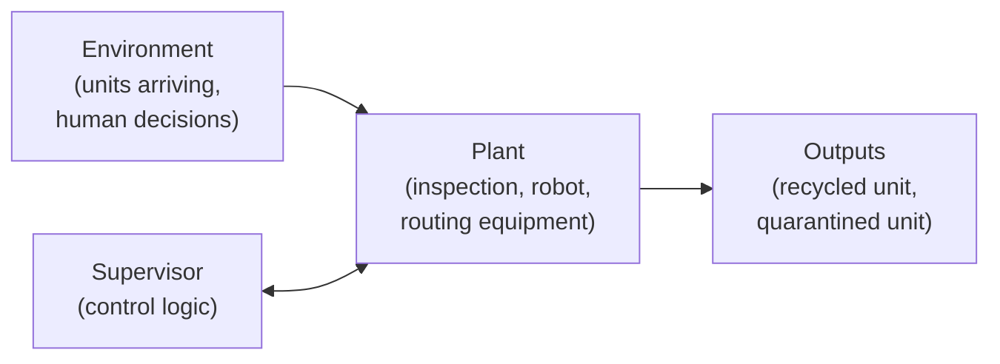
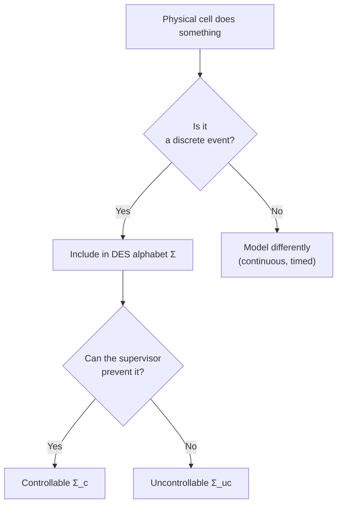

# Day 1 — DES Foundations

[← Back to Week 1 overview](README.md) · [Next: Day 2 — Automata →](day-02-automata.md)

## Learning objectives

By the end of today you should be able to:

1. Define what a discrete-event system (DES) is and how it differs from time-driven systems
2. Explain why a demanufacturing cell is naturally modelled as a DES
3. Identify events in a physical system and classify them
4. Define the "plant boundary" for modelling purposes
5. Draft an initial event alphabet for a demanufacturing cell

## Prerequisites

- Basic familiarity with state machines (informal level is fine)
- Understanding of what a manufacturing/demanufacturing cell does physically

## Core theory

### What is a discrete-event system?

A **discrete-event system (DES)** is a dynamic system whose state changes occur at discrete points in time, triggered by the occurrence of **events**. Unlike continuous or time-driven systems (where state evolves with a clock), a DES transitions only when something *happens*.

> **Definition (Cassandras).** A discrete-event system is a discrete-state, event-driven system: its state space is a discrete set, and state transitions are associated with asynchronous events occurring at discrete time instants.
>
> — *Discrete Event Systems*, C. G. Cassandras, [EOLSS Chapter](https://eolss.net/Sample-Chapters/C18/E6-43-27-00.pdf), §1–2.

Key characteristics:
- **Discrete state space** — the system is in one of a finite (or countable) set of states
- **Event-driven** — transitions happen when events occur, not at fixed time intervals
- **Asynchronous** — events may occur at irregular, unpredictable times

### Why demanufacturing is naturally event-driven

A demanufacturing cell processes end-of-life products through a sequence of discrete operations:

| Physical action | DES event |
|----------------|-----------|
| A laptop arrives on the conveyor | `arrival` |
| Visual inspection completes with "OK" result | `inspect_ok` |
| Visual inspection flags suspected hazard | `inspect_sus` |
| Robot unscrews the cover | `unscrew_cover` |
| Battery is physically removed | `remove_battery` |
| Unit is routed to recycling | `route_recycle` |
| Unit is routed to quarantine | `route_quarantine` |
| Machine faults mid-operation | `fault` |
| Emergency stop triggered | `e_stop` |

Each of these is an **event** — a discrete, instantaneous occurrence that causes a state change. Between events, the system sits in a well-defined state (e.g., "unit is under inspection"). This is the fundamental insight: **the cell's behaviour is a sequence of events, not a continuous trajectory**.

> **Derived explanation.** The Raisch course notes ([§1, pp. 7–9](https://www.hamilton.ie/ollie/Downloads/Hyb.pdf)) introduce DES by contrasting them with hybrid and continuous systems. The demanufacturing cell fits the DES model because every meaningful change in state corresponds to a sensor reading, an actuator completion, a human decision, or a fault — all discrete events.

### The plant boundary

Before modelling, you must decide what is *inside* the model (the **plant**) and what is *outside* (the environment, humans, upstream/downstream systems).

For a demanufacturing cell, the plant typically includes:
- Conveyor / intake mechanism
- Inspection station (sensors, cameras, X-ray)
- Disassembly robot(s)
- Routing mechanism (gates, conveyors to outputs)

Events from outside the plant boundary (arrivals, human override decisions) are modelled as **uncontrollable** — the plant model includes them, but a supervisor cannot prevent them.

### Event classification: first pass

Every event in the alphabet should be classified along several axes:

| Axis | Options | Meaning |
|------|---------|---------|
| **Controllable / Uncontrollable** | Controllable: supervisor can disable it. Uncontrollable: it may happen regardless. | Actuator commands are typically controllable; sensor outcomes, faults, and external arrivals are uncontrollable. |
| **Observable / Unobservable** | Observable: the supervisor sees it happen. Unobservable: it happens silently. | Direct sensor signals are observable; hidden internal failures may be unobservable. |
| **Source** | PLC, sensor, actuator, human, MES | Traceability: where does the signal originate? |

> **Source.** The controllable/uncontrollable partition and its engineering interpretation (actuators vs sensors) is explained in Goorden et al., [*Modelling guidelines for component-based supervisory control synthesis*](https://www.cs.vu.nl/~wanf/pubs/modeling-guidelines.pdf), §2.1.

## Worked mini-example: cell alphabet v0

Here is a starter event alphabet for the running demanufacturing cell example:

| Event | Meaning | Controllable? | Observable? | Source |
|-------|---------|:---:|:---:|--------|
| `arrival` | Unit enters the cell | No | Yes | Sensor |
| `inspect_ok` | Inspection: no hazard detected | No | Yes | Sensor |
| `inspect_sus` | Inspection: suspected hazard | No | Yes | Sensor |
| `unscrew_cover` | Robot opens the unit | Yes | Yes | PLC/actuator |
| `remove_battery` | Battery removed by robot | Yes | Yes | PLC/actuator |
| `route_recycle` | Unit routed to recycling output | Yes | Yes | PLC/actuator |
| `route_quarantine` | Unit routed to quarantine | Yes | Yes | PLC/actuator |
| `fault` | Equipment fault detected | No | Yes | Sensor |
| `e_stop` | Emergency stop activated | No | Yes | Human/sensor |

**Note:** This is `v0` — a first approximation. As modelling progresses, events may be added (e.g., `inspect_start`, `unscrew_complete`) or reclassified (e.g., discovering that `remove_battery` success is only partially observable).

## Intuition checkpoint

## Connection to the PhD proposal

The event alphabet is the **first formal artefact** for the proposal execution. It defines:
- The **interface** between the physical cell and the formal model
- The **controllability partition** that determines what a supervisor can do
- The **observability partition** that determines what a supervisor can know
- The raw material for constructing plant automata (Day 2), safety specs (Day 3), and supervisor logic (Day 6)

Every later layer — digital twin event log, belief-state tracker, conservative classifier, LLM mediation gate — receives its inputs as events from this alphabet.

## Recap

| Concept | Key point |
|---------|-----------|
| DES | State changes at discrete instants, triggered by events |
| Event | An instantaneous occurrence that causes a state transition |
| Plant boundary | What is inside the model vs outside (environment) |
| Controllable event | Supervisor can prevent it (actuator commands) |
| Uncontrollable event | Cannot be prevented (sensor outcomes, faults, arrivals) |
| Event alphabet Σ | The set of all events the model recognises |

## Exercises

1. List 5 additional events that might occur in a real demanufacturing cell (beyond the table above). Classify each as controllable or uncontrollable.
2. For the cell alphabet v0 above, identify which events could reasonably be *unobservable* and explain why.
3. Where would you draw the plant boundary if the cell includes a human operator who manually handles exceptions?

*These are self-check discussion questions. For graded exercises with full solutions, see [exercises.md](exercises.md).*

## Sources

| Source | What it provides for this day |
|--------|-------------------------------|
| Cassandras, [*Discrete Event Systems*](https://eolss.net/Sample-Chapters/C18/E6-43-27-00.pdf), EOLSS, §1–4 | DES definition, contrast with time-driven systems, modelling overview |
| Raisch, [*Discrete Event and Hybrid Systems*](https://www.hamilton.ie/ollie/Downloads/Hyb.pdf), TU Berlin, Ch. 1 (pp. 7–9) | DES introduction, course framing, hybrid systems context |
| Goorden et al., [*Modelling guidelines for component-based supervisory control synthesis*](https://www.cs.vu.nl/~wanf/pubs/modeling-guidelines.pdf), §2.1 | Event classification: controllable vs uncontrollable, actuators vs sensors |

---

[← Back to Week 1 overview](README.md) · [Next: Day 2 — Automata →](day-02-automata.md)
