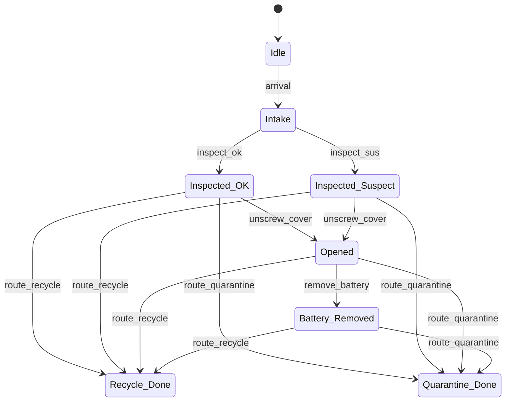
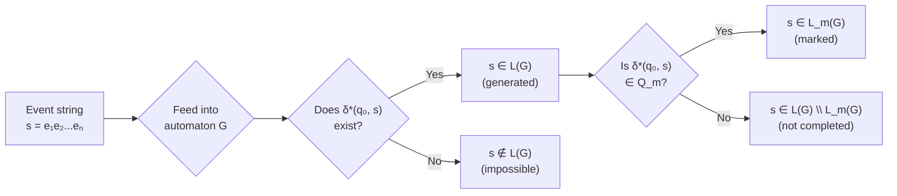

# Day 2 — Automata for DES

[← Day 1: DES Foundations](day-01-des-foundations.md) · [Back to overview](README.md) · [Next: Day 3 — Supervisory Control →](day-03-supervisory-control.md)

## Learning objectives

1. Define a finite automaton formally (states, events, transition function, initial state, marked states)
2. Understand marked states and the marked language
3. Distinguish DFA from NFA and know why it matters for DES
4. Build a small plant automaton for the demanufacturing cell
5. Trace event strings through an automaton and identify accepted/rejected strings

## Prerequisites

- Day 1 concepts: DES, events, event alphabet, controllability
- Basic set notation (∪, ∩, ⊆)

## Core theory

### Finite automata as DES models

In supervisory control theory, a DES plant is modelled as a **finite automaton** — a directed graph where nodes are states and edges are labelled with events.

> **Definition (Raisch).** A (deterministic) finite automaton with marked states is a 5-tuple:
>
> $$G = (Q,\; \Sigma,\; \delta,\; q_0,\; Q_m)$$
>
> where:
> - $Q$ is a finite set of **states**
> - $\Sigma$ is a finite set of **events** (the alphabet)
> - $\delta: Q \times \Sigma \to Q$ is a (partial) **transition function**
> - $q_0 \in Q$ is the **initial state**
> - $Q_m \subseteq Q$ is the set of **marked states**
>
> — Raisch, [*Discrete Event and Hybrid Systems*](https://www.hamilton.ie/ollie/Downloads/Hyb.pdf), §4.5.1 (pp. 73–74).

### Key concepts

**Generated language** $L(G)$: the set of all finite strings (sequences of events) that the automaton can produce starting from $q_0$. This represents everything the plant *can* do.

**Marked language** $L_m(G)$: the subset of $L(G)$ consisting of strings that end in a marked state. Marked states represent **task completion** — in demanufacturing, this means "the unit has been safely recycled or quarantined."

**Why marked states matter:** The nonblocking property (Day 5) is defined in terms of marked states. A system is nonblocking if every reachable state can still reach a marked state — the system can always finish what it started.

### DFA vs NFA

| | DFA (Deterministic) | NFA (Nondeterministic) |
|---|---|---|
| Transition function | At most one next state per (state, event) pair | Multiple possible next states |
| In DES modelling | Standard for plant models | Useful for specifications |
| Equivalence | Every NFA can be converted to an equivalent DFA | — |

> **Source.** DFA/NFA definitions and the subset construction (NFA→DFA) are covered in Sipser, MIT OCW 18.404J [Lecture 1](https://ocw.mit.edu/courses/18-404j-theory-of-computation-fall-2020/b4d9bf1573dccea21bee82cfba4224d4_MIT18_404f20_lec1.pdf) and [Lecture 2](https://ocw.mit.edu/courses/18-404j-theory-of-computation-fall-2020/d741901d23b4522588e267177c77d10d_MIT18_404f20_lec2.pdf).

For SCT, plant models are typically **deterministic** (one physical outcome per state-event pair), but specifications may be nondeterministic initially and then determinised.

## Worked mini-example: demanufacturing cell automaton

Using the event alphabet from [Day 1](day-01-des-foundations.md), here is a plant automaton for the demanufacturing cell:

### Formal definition

$$G_{\text{cell}} = (Q,\; \Sigma,\; \delta,\; q_0,\; Q_m)$$

- $Q = \{$ `Idle`, `Intake`, `Inspected_OK`, `Inspected_Suspect`, `Opened`, `Battery_Removed`, `Recycle_Done`, `Quarantine_Done` $\}$
- $\Sigma = \{$ `arrival`, `inspect_ok`, `inspect_sus`, `unscrew_cover`, `remove_battery`, `route_recycle`, `route_quarantine` $\}$
- $q_0 =$ `Idle`
- $Q_m = \{$ `Recycle_Done`, `Quarantine_Done` $\}$

### State diagram

> **Note:** This is the **unsupervised plant** — it includes *all* physically possible transitions, including unsafe ones (e.g., recycling a suspect unit, recycling without battery removal). The supervisor will restrict these on Days 3 and 6.

### Transition table

| Current state | Event | Next state |
|--------------|-------|------------|
| `Idle` | `arrival` | `Intake` |
| `Intake` | `inspect_ok` | `Inspected_OK` |
| `Intake` | `inspect_sus` | `Inspected_Suspect` |
| `Inspected_OK` | `unscrew_cover` | `Opened` |
| `Inspected_OK` | `route_quarantine` | `Quarantine_Done` |
| `Inspected_OK` | `route_recycle` | `Recycle_Done` |
| `Inspected_Suspect` | `route_quarantine` | `Quarantine_Done` |
| `Inspected_Suspect` | `unscrew_cover` | `Opened` |
| `Inspected_Suspect` | `route_recycle` | `Recycle_Done` |
| `Opened` | `remove_battery` | `Battery_Removed` |
| `Opened` | `route_quarantine` | `Quarantine_Done` |
| `Opened` | `route_recycle` | `Recycle_Done` |
| `Battery_Removed` | `route_recycle` | `Recycle_Done` |
| `Battery_Removed` | `route_quarantine` | `Quarantine_Done` |

### Example traces

| Trace | Ends in | Marked? | Safe? |
|-------|---------|:---:|:---:|
| `arrival, inspect_ok, unscrew_cover, remove_battery, route_recycle` | `Recycle_Done` | ✅ | ✅ |
| `arrival, inspect_sus, route_quarantine` | `Quarantine_Done` | ✅ | ✅ |
| `arrival, inspect_ok, route_quarantine` | `Quarantine_Done` | ✅ | ✅ |
| `arrival, inspect_sus, route_recycle` | `Recycle_Done` | ✅ | ❌ Unsafe — suspect unit recycled |
| `arrival, inspect_sus, unscrew_cover` | `Opened` | ❌ | ❌ Unsafe — opened a suspect unit |

The last two traces reach states via unsafe paths. This is *intentional* in the plant model: the plant represents what is physically *possible*, not what is *allowed*. The supervisor's job (Day 3) is to prevent these.

## Intuition: languages and string acceptance

## Connection to the PhD proposal

The plant automaton $G$ is the formal object that the rest of the proposal builds on:

- The **supervisor** (Day 3) restricts $L(G)$ to a safe sublanguage
- The **digital twin** (Week 4) replays event strings from $L(G)$ as its event log
- The **belief-state tracker** (Weeks 2–3) maintains a distribution over $Q$ when events are partially observable
- The **event alphabet** $\Sigma$ defines the interface between the physical cell and all computational layers

## Recap

| Concept | Key point |
|---------|-----------|
| Finite automaton $G$ | 5-tuple $(Q, \Sigma, \delta, q_0, Q_m)$ modelling all possible plant behaviour |
| Generated language $L(G)$ | All event strings the plant can produce |
| Marked language $L_m(G)$ | Strings ending in a marked (completed) state |
| Marked states $Q_m$ | Represent successful task completion |
| DFA vs NFA | DFA: deterministic, standard for plants. NFA: useful for specs, convertible to DFA |

## Exercises

1. Add a `fault` event to the automaton above. Where should it lead? Should any state have a `fault` transition? What should the `fault` state look like (marked or not)?
2. Write three more traces through the automaton. For each, state whether it is in $L(G)$, whether it is in $L_m(G)$, and whether it is safe.
3. Why is `Idle` not a marked state in this model? Under what modelling choice *could* it be marked?

*These are self-check discussion questions. For graded exercises with full solutions, see [exercises.md](exercises.md).*

## Sources

| Source | What it provides for this day |
|--------|-------------------------------|
| Raisch, [*Discrete Event and Hybrid Systems*](https://www.hamilton.ie/ollie/Downloads/Hyb.pdf), §4.5.1 (pp. 73–74) | Formal automaton definition with marked states |
| Sipser, MIT OCW 18.404J [Lecture 1](https://ocw.mit.edu/courses/18-404j-theory-of-computation-fall-2020/b4d9bf1573dccea21bee82cfba4224d4_MIT18_404f20_lec1.pdf) | DFA definition, regular languages |
| Sipser, MIT OCW 18.404J [Lecture 2](https://ocw.mit.edu/courses/18-404j-theory-of-computation-fall-2020/d741901d23b4522588e267177c77d10d_MIT18_404f20_lec2.pdf) | NFA, NFA→DFA construction, equivalence |
| Cai & Wonham, [*Supervisory Control of DES*](https://www.caikai.org/publication/CaiWonham_20Encyclo.pdf) (2020), pp. 1–3 | RW base model, generated/marked languages in SCT context |

---

[← Day 1: DES Foundations](day-01-des-foundations.md) · [Back to overview](README.md) · [Next: Day 3 — Supervisory Control →](day-03-supervisory-control.md)
