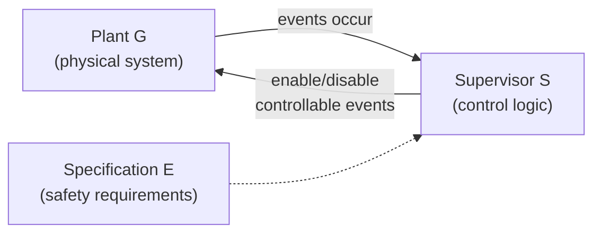
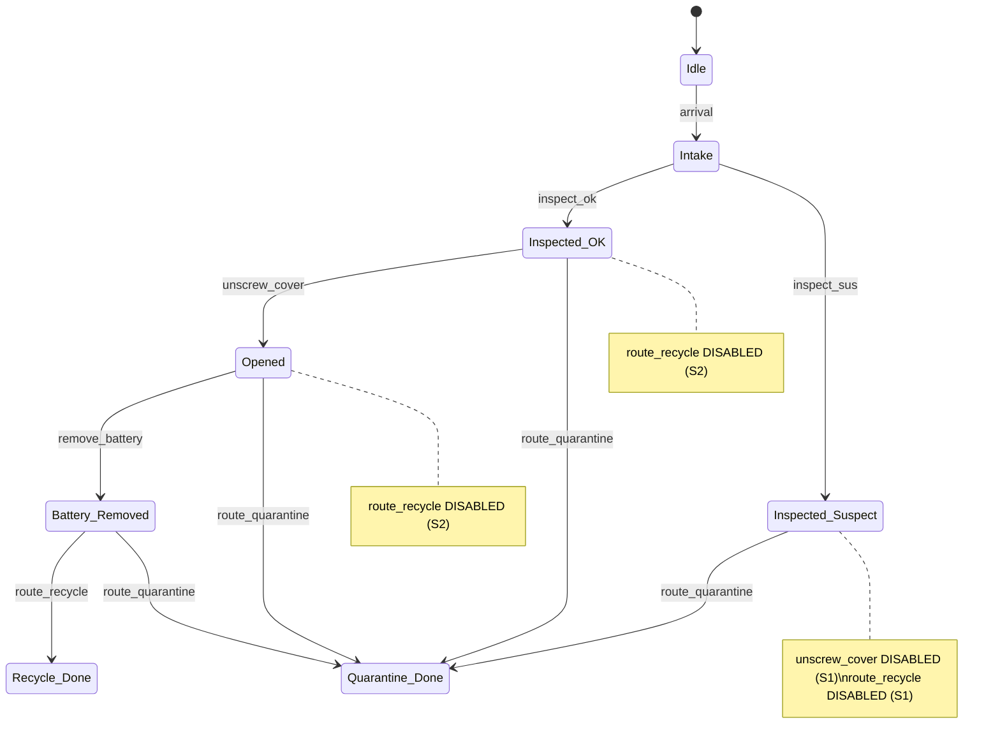

# Day 3 — Supervisory Control Theory

[← Day 2: Automata](day-02-automata.md) · [Back to overview](README.md) · [Next: Day 4 — Controllability & Observability →](day-04-controllability-observability.md)

## Learning objectives

1. Understand the plant/supervisor feedback loop
2. Define what a supervisor does: selectively disable controllable events
3. Explain the supervisory control problem: find a maximally permissive, safe, nonblocking supervisor
4. Understand the event partition $\Sigma = \Sigma_c \cup \Sigma_{uc}$ in the supervisor context
5. Build a first safety specification for the demanufacturing cell

## Prerequisites

- Day 1: DES, events, controllable vs uncontrollable
- Day 2: finite automata, generated/marked languages

## Core theory

### The supervisory control problem

In the Ramadge–Wonham (RW) framework, the DES control problem has three parts:

1. **Plant** $G$: an automaton modelling everything the system *can* do (including unsafe behaviour)
2. **Specification** $E$: a description of what the system *should* do (or what it must *not* do)
3. **Supervisor** $S$: a control agent that observes events and selectively **disables controllable events** to ensure the closed-loop system satisfies $E$

> **Definition (Ramadge & Wonham, 1989).** The plant is modelled by a generator $G$ over event set $\Sigma = \Sigma_c \cup \Sigma_{uc}$. A supervisor $S$ maps observed event strings to a set of enabled events. At each instant, $S$ may disable any subset of $\Sigma_c$ but cannot disable any event in $\Sigma_{uc}$.
>
> — Ramadge & Wonham, [*The Control of Discrete Event Systems*](https://www.labri.fr/perso/anca/Games/Bib/RamadgeWonham89.pdf), Proc. IEEE, 1989.

### The feedback loop

The supervisor and plant form a **closed loop**:
1. The plant generates events (some controllable, some not)
2. The supervisor observes events and decides which controllable events to **enable** before the next step
3. The plant can only execute enabled events (but uncontrollable events happen regardless)

### What the supervisor can and cannot do

| Supervisor can | Supervisor cannot |
|---|---|
| Disable any controllable event | Prevent uncontrollable events |
| Observe events (fully or partially) | Force the plant to take a specific event |
| Choose *which* controllable events to allow | Change the plant's physical structure |

> **Source.** This enabling/disabling framing is developed in Lafortune, [*Supervisory Control of DES*](https://www.eolss.net/sample-chapters/c18/E6-43-27-02.pdf), EOLSS, §3–4, and in Cai & Wonham, [*Supervisory Control of DES*](https://www.caikai.org/publication/CaiWonham_20Encyclo.pdf) (2020), pp. 1–5.

### Specification types

Safety requirements can be expressed in several ways:

| Form | How it works | Example |
|------|-------------|---------|
| **Forbidden states** | List states that must never be reached | "Never reach `Opened` via `inspect_sus`" |
| **Forbidden strings** | List event substrings that must never occur | "Never execute `inspect_sus · unscrew_cover`" |
| **Specification automaton** | An automaton $E$ that generates only legal behaviour | $L_m(E)$ = set of allowed event sequences |

The specification automaton approach is the most general and is standard in SCT.

### Synthesis goal: the supremal controllable sublanguage

Given plant $G$ and specification $E$, the ideal supervisor realises the **supremal controllable sublanguage** — the largest possible subset of the legal language that is:

1. **Safe** — stays within the specification
2. **Controllable** — closed under uncontrollable events (see [Day 4](day-04-controllability-observability.md))
3. **Nonblocking** — every reachable state can reach a marked state (see [Day 5](day-05-safety-liveness-blocking.md))
4. **Maximally permissive** — does not disable more than necessary

> **Source.** The supremal controllable sublanguage and its computation are defined in Lafortune, [EOLSS §4](https://www.eolss.net/sample-chapters/c18/E6-43-27-02.pdf), and in Cai & Wonham (2020), [pp. 3–5](https://www.caikai.org/publication/CaiWonham_20Encyclo.pdf).

## Worked mini-example: safety specs for the demanufacturing cell

Using the plant automaton from [Day 2](day-02-automata.md), define two safety constraints:

### S1 — Hazard rule

> If inspection flags "suspect," the unit must **not** be opened or recycled.

Forbidden transitions from `Inspected_Suspect`:
- `unscrew_cover` (would open a potentially hazardous unit)
- `route_recycle` (would recycle without proper quarantine handling)

### S2 — Battery rule

> A unit must **not** be recycled unless the battery has been removed.

Forbidden:
- `route_recycle` from `Inspected_OK` (battery still inside)
- `route_recycle` from `Opened` (battery still inside)

Only `Battery_Removed → route_recycle` is safe.

### Supervisor as an enabling function

The supervisor is a map from states to enabled controllable events:

| State | Enabled controllable events | Disabled (with reason) |
|-------|----------------------------|----------------------|
| `Idle` | — | — |
| `Intake` | — | — |
| `Inspected_OK` | `unscrew_cover`, `route_quarantine` | `route_recycle` (S2: battery not removed) |
| `Inspected_Suspect` | `route_quarantine` | `unscrew_cover` (S1), `route_recycle` (S1) |
| `Opened` | `remove_battery`, `route_quarantine` | `route_recycle` (S2: battery not removed) |
| `Battery_Removed` | `route_recycle`, `route_quarantine` | — |
| Done states | — | — |

### Supervised state diagram

> **Derived explanation.** Compare this with the unsupervised plant on [Day 2](day-02-automata.md). The supervisor removes exactly the transitions that violate S1 or S2. It does not remove more than necessary — this is **maximal permissiveness**.

## Connection to the PhD proposal

The supervisor rule table is the formal object that:
- **Bounds** what the cell is allowed to do at execution time
- Provides the **supervisor-enabled set** that the digital twin and learning layers must respect
- Guarantees **safety by construction** — if the supervisor is correct, no unsafe trace can occur
- Forms the foundation for modular/hierarchical supervisor composition as the cell model grows

## Recap

| Concept | Key point |
|---------|-----------|
| Supervisor $S$ | Observes events, enables/disables controllable events |
| Plant/supervisor loop | Closed feedback loop: plant generates, supervisor restricts |
| Specification $E$ | What is allowed (or what is forbidden) |
| Supremal controllable sublanguage | Largest safe, controllable, nonblocking behaviour |
| Maximally permissive | Disable only what is necessary for safety |

## Exercises

1. For the supervisor table above, verify that every uncontrollable event (`arrival`, `inspect_ok`, `inspect_sus`) is always enabled. Why must this be the case?
2. Could the supervisor also disable `route_quarantine` somewhere? Would that reduce safety or just reduce permissiveness?
3. Add a third safety rule S3: "If the robot faults during `unscrew_cover`, the unit must be quarantined." How would you modify the plant automaton and the supervisor table?

*These are self-check discussion questions. For graded exercises with full solutions, see [exercises.md](exercises.md).*

## Sources

| Source | What it provides for this day |
|--------|-------------------------------|
| Ramadge & Wonham, [*The Control of Discrete Event Systems*](https://www.labri.fr/perso/anca/Games/Bib/RamadgeWonham89.pdf), 1989 | Foundational RW framework: plant, supervisor, controllability |
| Lafortune, [*Supervisory Control of DES*](https://www.eolss.net/sample-chapters/c18/E6-43-27-02.pdf), EOLSS, §3–5 | SCT introduction, supremal controllable sublanguage, synthesis ideas |
| Cai & Wonham, [*Supervisory Control of DES*](https://www.caikai.org/publication/CaiWonham_20Encyclo.pdf), 2020, pp. 1–5 | RW base model, controllability definition, nonblocking supervisor |
| Goorden et al., [*Modelling guidelines*](https://www.cs.vu.nl/~wanf/pubs/modeling-guidelines.pdf), §2.1 | Engineering event classification, maximally permissive synthesis framing |

---

[← Day 2: Automata](day-02-automata.md) · [Back to overview](README.md) · [Next: Day 4 — Controllability & Observability →](day-04-controllability-observability.md)
