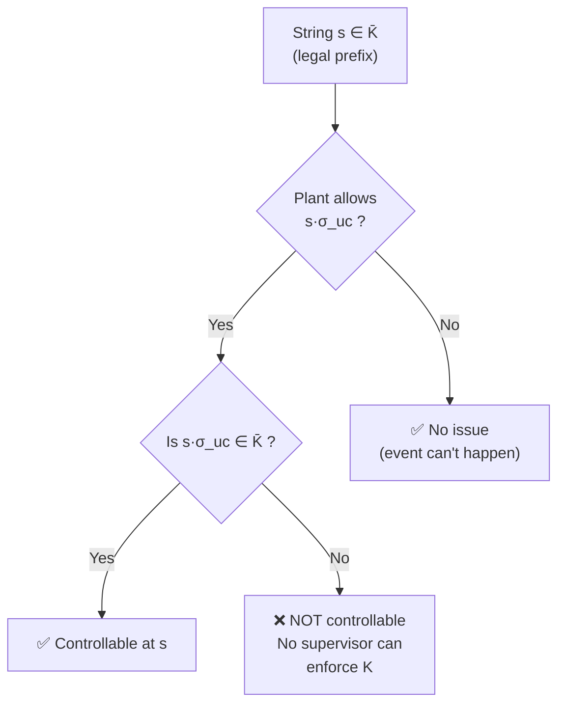
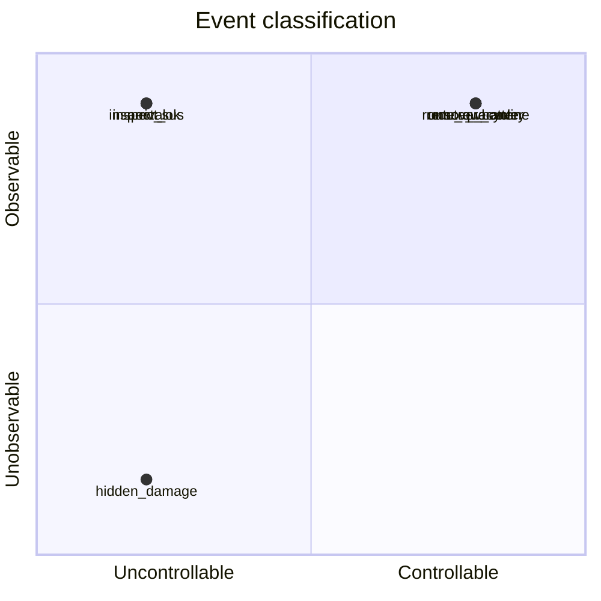

# Day 4 — Controllability and Observability

[← Day 3: Supervisory Control](day-03-supervisory-control.md) · [Back to overview](README.md) · [Next: Day 5 — Safety, Liveness & Blocking →](day-05-safety-liveness-blocking.md)

## Learning objectives

1. State the formal controllability condition and interpret it intuitively
2. Explain why controllability is necessary for a supervisor to exist
3. Define observability and the natural projection
4. Understand why partial observation complicates supervisor design
5. Identify observable and unobservable events in the demanufacturing cell

## Prerequisites

- Day 2: automata, languages $L(G)$ and $L_m(G)$
- Day 3: supervisor, enabling function, $\Sigma_c$ vs $\Sigma_{uc}$

## Core theory

### Controllability

#### The key constraint

A supervisor can only disable **controllable** events. If the plant is in a legal state and an **uncontrollable** event can happen next (according to the plant), then the supervisor cannot prevent it. This means the legal language $K$ must already include that continuation.

> **Definition (Controllability condition).** A language $K \subseteq L(G)$ is **controllable** with respect to plant $G$ and uncontrollable events $\Sigma_{uc}$ if:
>
> $$\overline{K}\,\Sigma_{uc} \cap L(G) \subseteq \overline{K}$$
>
> where $\overline{K}$ denotes the prefix-closure of $K$.
>
> — Cai & Wonham, [*Supervisory Control of DES*](https://www.caikai.org/publication/CaiWonham_20Encyclo.pdf), 2020, Definition 2 (p. 3).

#### Intuitive reading

> If you are in a state that the legal specification allows (i.e., some prefix in $\overline{K}$), and an uncontrollable event $\sigma_{uc} \in \Sigma_{uc}$ can occur in the plant, then the resulting string must *still* be legal (still in $\overline{K}$).

If this fails for any string, then no supervisor can enforce $K$ — because the supervisor cannot block the uncontrollable event that exits the legal region.

#### Example in the demanufacturing cell

Consider the string `arrival`. After arrival, two uncontrollable events can occur: `inspect_ok` and `inspect_sus`. Both must be included in any legal specification — because the supervisor cannot prevent the inspection outcome.

This is why the supervisor on [Day 3](day-03-supervisory-control.md) never disables `arrival`, `inspect_ok`, or `inspect_sus` — they are uncontrollable, and any proposed legal language must accommodate them.

### Observability

#### Why observation matters

So far we assumed the supervisor sees every event. In practice, some events may be **unobservable** — the supervisor cannot directly detect them. This creates a fundamental limitation: the supervisor must make the same control decision for every pair of strings that *look identical* from its perspective.

> **Definition (Natural projection).** Let $\Sigma_o \subseteq \Sigma$ be the set of **observable** events. The **natural projection** $P: \Sigma^* \to \Sigma_o^*$ erases all events not in $\Sigma_o$:
>
> $$P(\varepsilon) = \varepsilon, \quad P(\sigma) = \begin{cases} \sigma & \text{if } \sigma \in \Sigma_o \\\\ \varepsilon & \text{if } \sigma \notin \Sigma_o \end{cases}, \quad P(s\sigma) = P(s) \cdot P(\sigma)$$
>
> — Cai & Wonham (2020), [p. 8](https://www.caikai.org/publication/CaiWonham_20Encyclo.pdf); Lafortune, [EOLSS §5.2](https://www.eolss.net/sample-chapters/c18/E6-43-27-02.pdf).

#### The observability condition

> **Observability (informal).** A language $K$ is observable if, whenever two strings $s$ and $s'$ have the same projection $P(s) = P(s')$, the supervisor's enable/disable decision must be the same for both.

If two different internal histories look identical to the supervisor, it must make a consistent choice — otherwise it would need information it does not have.

> **Important subtlety.** Standard observability is **not closed under union**: the union of two observable languages may not be observable. This is why SCT research has developed stronger alternatives:
> - **Normality**: a sufficient condition that *is* closed under union
> - **Relative observability**: a weaker but more practical condition
>
> — Cai & Wonham (2020), [pp. 8–9](https://www.caikai.org/publication/CaiWonham_20Encyclo.pdf).

### Four-way event classification

Combining controllability and observability, each event falls into one of four categories:

| | Observable | Unobservable |
|---|:---:|:---:|
| **Controllable** | Standard control events (e.g., `unscrew_cover`) | Risky: supervisor can disable but can't confirm execution |
| **Uncontrollable** | Sensor events (e.g., `inspect_ok`) | Most dangerous: supervisor can't prevent or see it |

## Worked mini-example: sensor model v0

For each safety-critical event in the demanufacturing cell, identify how it becomes observable:

| Event | Observable? | How observed | Risk if unobservable |
|-------|:---:|-------------|---------------------|
| `arrival` | Yes | Conveyor sensor | Low — arrival is externally visible |
| `inspect_ok` | Yes | Camera/sensor result | Medium — sensor false negative means missed hazard |
| `inspect_sus` | Yes | Camera/sensor result | Medium — false positive wastes capacity |
| `unscrew_cover` | Yes | PLC completion signal | Medium — if command not confirmed, unit state is uncertain |
| `remove_battery` | Partially | PLC signal + vision | **High** — if battery removal fails silently, unit is recycled unsafely |
| `hidden_damage` | **No** | Not directly detectable | **High** — internal damage invisible to standard sensors |
| `route_recycle` | Yes | Gate/conveyor sensor | Low |
| `route_quarantine` | Yes | Gate/conveyor sensor | Low |

**Key finding:** `remove_battery` confirmation and `hidden_damage` are partially or fully unobservable. This is where the observability theory meets real engineering constraints — and where later layers (belief states, conservative learning) will provide mitigation.

## Connection to the PhD proposal

Controllability and observability are **the two foundational constraints** on what any supervisor can achieve:

- **Controllability** bounds the supervisor's *action space* — it cannot prevent faults, sensor readings, or arrivals
- **Observability** bounds the supervisor's *information space* — it cannot distinguish states that look identical under projection

The proposal architecture addresses the observability gap through:
- The **digital twin** maintaining an event history (making past events queryable)
- The **belief-state tracker** maintaining a distribution over possible states
- The **conservative learning layer** deciding when to defer or abstain given uncertainty

## Recap

| Concept | Key point |
|---------|-----------|
| Controllability condition | $\overline{K}\,\Sigma_{uc} \cap L(G) \subseteq \overline{K}$ — legal language must be closed under uncontrollable events |
| Controllability intuition | If an uncontrollable event can happen, the legal language must already include it |
| Natural projection $P$ | Erases unobservable events from strings |
| Observability | Supervisor must make consistent decisions for indistinguishable strings |
| Normality / relative observability | Stronger substitutes when standard observability is too weak |

## Exercises

1. Given the plant from [Day 2](day-02-automata.md), verify the controllability condition for the supervised language defined on [Day 3](day-03-supervisory-control.md). Check: after every legal prefix, if an uncontrollable event is possible in the plant, is the result still in the legal language?
2. Suppose `remove_battery` becomes unobservable (the PLC reports "done" but doesn't confirm). How does this affect the supervisor's ability to enforce rule S2 ("no recycling without battery removal")?
3. Classify the event `e_stop` (emergency stop). Is it controllable? Observable? What are the implications for supervisor design?

*These are self-check discussion questions. For graded exercises with full solutions, see [exercises.md](exercises.md).*

## Sources

| Source | What it provides for this day |
|--------|-------------------------------|
| Cai & Wonham, [*Supervisory Control of DES*](https://www.caikai.org/publication/CaiWonham_20Encyclo.pdf), 2020, pp. 3–5, 8–9 | Controllability definition, observability/normality/relative observability |
| Lafortune, [*Supervisory Control of DES*](https://www.eolss.net/sample-chapters/c18/E6-43-27-02.pdf), EOLSS, §4–5 | Controllability condition, unobservability discussion |
| Ramadge & Wonham, [*The Control of DES*](https://www.labri.fr/perso/anca/Games/Bib/RamadgeWonham89.pdf), 1989 | Original controllability/observability framework |
| Goorden et al., [*Modelling guidelines*](https://www.cs.vu.nl/~wanf/pubs/modeling-guidelines.pdf), §2.1 | Engineering interpretation: actuators (controllable) vs sensors (uncontrollable) |

---

[← Day 3: Supervisory Control](day-03-supervisory-control.md) · [Back to overview](README.md) · [Next: Day 5 — Safety, Liveness & Blocking →](day-05-safety-liveness-blocking.md)
