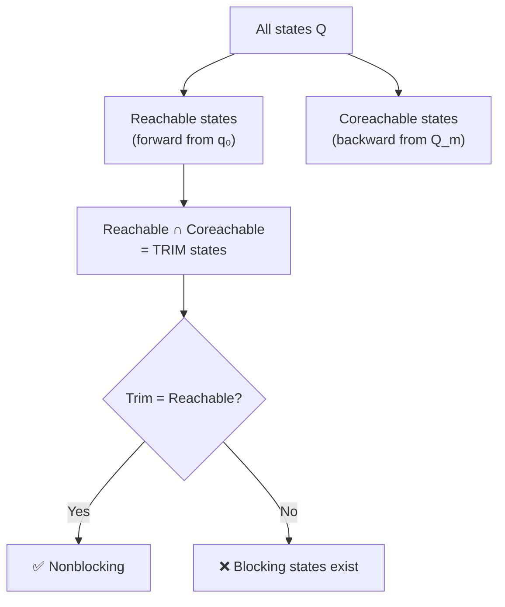
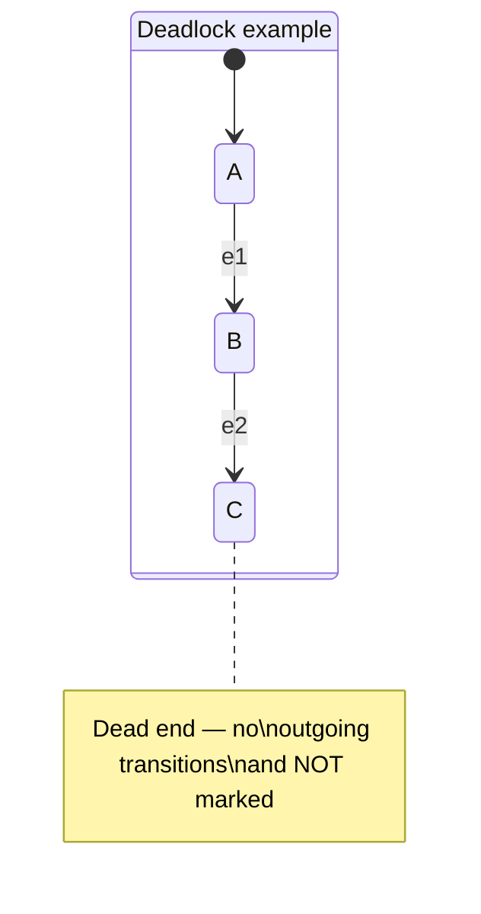
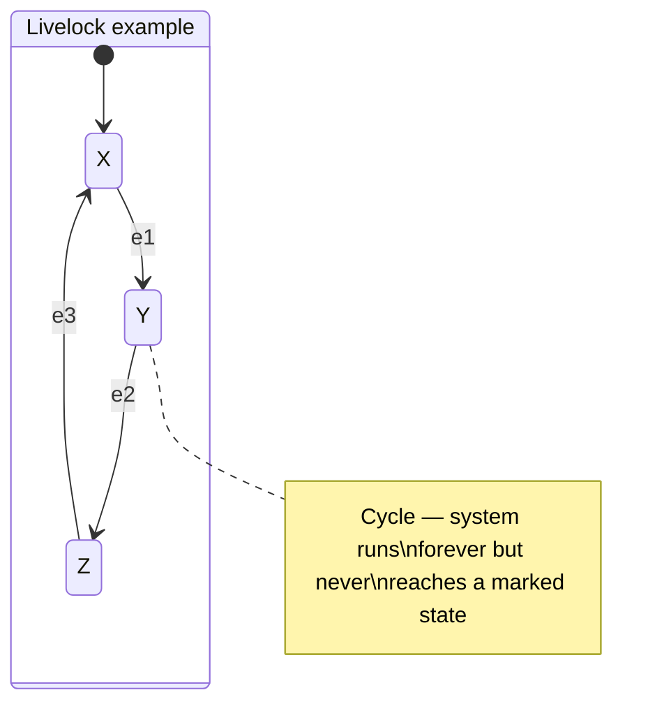

# Day 5 — Safety, Liveness, and Blocking

[← Day 4: Controllability & Observability](day-04-controllability-observability.md) · [Back to overview](README.md) · [Next: Day 6 — Worked Example →](day-06-worked-example-automata-supervisor.md)

## Learning objectives

1. Distinguish safety from liveness properties
2. Define nonblocking formally and explain its importance
3. Distinguish deadlock from livelock
4. Perform a reachability and coreachability check on a small automaton
5. Identify blocking scenarios and how a supervisor prevents them

## Prerequisites

- Day 2: automata, marked states, $L_m(G)$
- Day 3: supervisor, safety specifications
- Day 4: controllability

## Core theory

### Safety vs liveness

These are the two fundamental categories of properties in DES (and in formal verification generally):

| Property | Informal meaning | Formal flavour | SCT connection |
|----------|-----------------|----------------|----------------|
| **Safety** | "Nothing bad ever happens" | The system never enters a forbidden state or produces a forbidden string | Enforced by the supervisor disabling controllable events before bad transitions |
| **Liveness** | "Something good eventually happens" | The system can always make progress toward a goal (marked state) | Ensured by the nonblocking property |

> **Source.** The safety/liveness distinction in the DES context is articulated in Cai & Wonham (2020), [pp. 3–5](https://www.caikai.org/publication/CaiWonham_20Encyclo.pdf), and in Lafortune, [EOLSS §4](https://www.eolss.net/sample-chapters/c18/E6-43-27-02.pdf).

**A supervisor must achieve both**: disabling unsafe transitions (safety) while not being so restrictive that the system gets stuck (liveness).

### Nonblocking: the formal definition

> **Definition (Nonblocking).** A DES $G$ is **nonblocking** if:
>
> $$\overline{L_m(G)} = L(G)$$
>
> Equivalently: **every reachable state can reach a marked state** via some continuation of events.
>
> — Cai & Wonham (2020), [p. 2](https://www.caikai.org/publication/CaiWonham_20Encyclo.pdf); Raisch, [*DES and Hybrid Systems*](https://www.hamilton.ie/ollie/Downloads/Hyb.pdf), p. 75.

This means: no matter what has happened so far, the system can always finish its current task. There is no "dead end" from which completion is impossible.

### Reachability and coreachability

Two key concepts for checking nonblocking:

| Concept | Definition | Purpose |
|---------|-----------|---------|
| **Reachable** | A state $q$ is reachable if there exists a string $s$ such that $\delta(q_0, s) = q$ | Which states can the system actually get to? |
| **Coreachable** | A state $q$ is coreachable if there exists a string $s$ such that $\delta(q, s) \in Q_m$ | From which states can the system still reach a marked state? |

**Nonblocking ⟺ every reachable state is also coreachable.**

> **Source.** The trim operation (keeping only states that are both reachable and coreachable) is a standard procedure. The TCT tool provides `trim` for exactly this purpose — see [TCT manual](https://www.caikai.org/teaching/des-course/TCT.pdf).

### Deadlock vs livelock

Both are forms of **blocking** — the system is stuck and cannot reach a marked state:

| Type | What happens | Example |
|------|-------------|---------|
| **Deadlock** | No transitions enabled at all — the system is frozen | A state with no outgoing transitions (and that is not marked) |
| **Livelock** | Transitions exist, but all of them lead only to non-marked states in a cycle | The system keeps running forever without ever completing |

> **Source.** Raisch, [*DES and Hybrid Systems*](https://www.hamilton.ie/ollie/Downloads/Hyb.pdf), pp. 74–75, explicitly distinguishes deadlock from livelock.

## Worked mini-example: blocking analysis of the demanufacturing cell

Consider a scenario where the supervisor is **too restrictive**. Suppose we add an over-eager rule:

> **Bad rule:** "If inspection returns `inspect_sus`, disable *all* controllable events."

This would mean in state `Inspected_Suspect`, both `route_quarantine` and `unscrew_cover` are disabled. Since there are no uncontrollable events from this state either, the system is **deadlocked** in `Inspected_Suspect`.

### Checking nonblocking for the correct supervisor

With the supervisor from [Day 3](day-03-supervisory-control.md):

| Reachable state | Can reach a marked state? | Path to marked state |
|----------------|:---:|---------------------|
| `Idle` | ✅ | `arrival` → `inspect_ok/inspect_sus` → completion |
| `Intake` | ✅ | Uncontrollable `inspect_ok` or `inspect_sus` always fires → completion paths exist |
| `Inspected_OK` | ✅ | `unscrew_cover` → `remove_battery` → `route_recycle` |
| `Inspected_Suspect` | ✅ | `route_quarantine` → `Quarantine_Done` |
| `Opened` | ✅ | `remove_battery` → `route_recycle` or `route_quarantine` |
| `Battery_Removed` | ✅ | `route_recycle` or `route_quarantine` |
| `Recycle_Done` | ✅ | Already marked |
| `Quarantine_Done` | ✅ | Already marked |

Every reachable state is coreachable → the supervised system is **nonblocking** ✅.

### What if we had an unreachable state?

If the plant had a state `Error_Recovery` with no incoming transitions, it would be unreachable — and harmless (it never occurs). The trim operation would remove it, but nonblocking would still hold for the reachable portion.

## Connection to the PhD proposal

The nonblocking property is **essential** for the proposal:

- It guarantees the demanufacturing cell can always **complete processing** — no unit gets permanently stuck
- "Handoff to human" could be modelled as a marked state if manual intervention is an acceptable completion
- The digital twin's "current state" tracking implicitly depends on nonblocking: if blocking occurs, the twin enters an unrecoverable state
- The conservative learning layer must respect nonblocking: it cannot make decisions that create dead ends in the supervised system

## Recap

| Concept | Key point |
|---------|-----------|
| Safety | "Nothing bad ever happens" — no forbidden states reached |
| Liveness | "Something good eventually happens" — progress toward completion |
| Nonblocking | $\overline{L_m(G)} = L(G)$ — every reachable state can reach a marked state |
| Reachable | Forward-reachable from $q_0$ |
| Coreachable | Backward-reachable to $Q_m$ |
| Trim | Reachable ∩ coreachable — the useful states |
| Deadlock | No enabled transitions (stuck) |
| Livelock | Transitions exist but no path to marked states (cycling forever) |

## Exercises

1. Draw a 4-state automaton that is **not** nonblocking. Identify the blocking state(s) and explain whether each is a deadlock or a livelock.
2. For the supervised demanufacturing cell, add a `fault` state reachable from `Opened` via an uncontrollable `fault` event. Is the supervised system still nonblocking? If not, what could you add to restore it?
3. Explain in one paragraph why an overly restrictive supervisor (disabling too many events) can cause blocking even if it achieves safety.

*These are self-check discussion questions. For graded exercises with full solutions, see [exercises.md](exercises.md).*

## Sources

| Source | What it provides for this day |
|--------|-------------------------------|
| Cai & Wonham, [*Supervisory Control of DES*](https://www.caikai.org/publication/CaiWonham_20Encyclo.pdf), 2020, pp. 2–5 | Nonblocking definition, nonblocking supervisor requirement |
| Raisch, [*DES and Hybrid Systems*](https://www.hamilton.ie/ollie/Downloads/Hyb.pdf), pp. 74–75 | Deadlock vs livelock, nonblocking as "every reachable state reaches a marked state" |
| Lafortune, [*Supervisory Control of DES*](https://www.eolss.net/sample-chapters/c18/E6-43-27-02.pdf), §4 | Nonblocking in the SCT synthesis context |
| [TCT manual](https://www.caikai.org/teaching/des-course/TCT.pdf) | `trim`, `sync`, `supcon`, `condat` operations for blocking analysis |

---

[← Day 4: Controllability & Observability](day-04-controllability-observability.md) · [Back to overview](README.md) · [Next: Day 6 — Worked Example →](day-06-worked-example-automata-supervisor.md)
