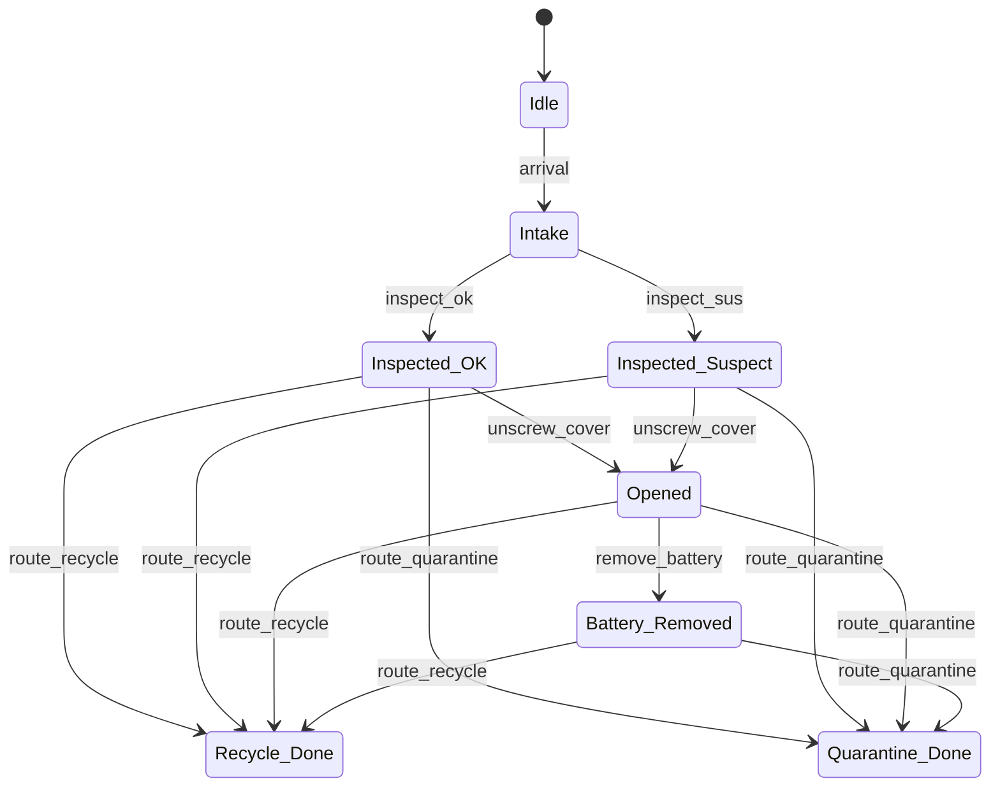
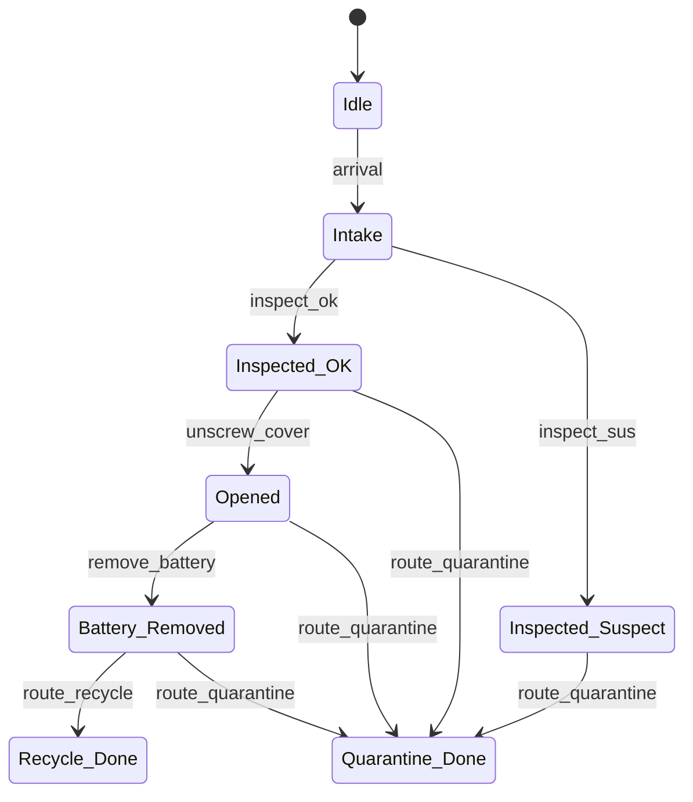

# Day 6 — Worked Example: Automaton + Supervisor for a Demanufacturing Cell

[← Day 5: Safety, Liveness & Blocking](day-05-safety-liveness-blocking.md) · [Back to overview](README.md) · [Next: Day 7 — Intro Petri Nets →](day-07-intro-petri-nets.md)

## Learning objectives

1. Combine all Week 1 concepts into one coherent worked example
2. Build a complete supervised automaton: plant + specs + supervisor + analysis
3. Verify controllability and nonblocking for the supervised model
4. Produce a proposal-ready artefact: supervisor rule table with justification

## Prerequisites

- Days 1–5: DES, automata, SCT, controllability, observability, nonblocking

## Overview

This day integrates everything from the week into a single, complete worked example. The demanufacturing cell scenario has been developed incrementally:

| Day | Contribution |
|-----|-------------|
| Day 1 | Event alphabet v0 |
| Day 2 | Plant automaton $G$ |
| Day 3 | Safety specs S1, S2 + supervisor rule table |
| Day 4 | Controllability verification + observability notes |
| Day 5 | Nonblocking check |
| **Day 6** | **Everything together, refined and verified** |

## Complete plant automaton

### Formal definition

$$G_{\text{cell}} = (Q,\; \Sigma,\; \delta,\; q_0,\; Q_m)$$

| Component | Value |
|-----------|-------|
| $Q$ | `{Idle, Intake, Inspected_OK, Inspected_Suspect, Opened, Battery_Removed, Recycle_Done, Quarantine_Done}` |
| $\Sigma$ | `{arrival, inspect_ok, inspect_sus, unscrew_cover, remove_battery, route_recycle, route_quarantine}` |
| $\Sigma_c$ | `{unscrew_cover, remove_battery, route_recycle, route_quarantine}` |
| $\Sigma_{uc}$ | `{arrival, inspect_ok, inspect_sus}` |
| $q_0$ | `Idle` |
| $Q_m$ | `{Recycle_Done, Quarantine_Done}` |

### Plant state diagram (unsupervised)

> This plant includes **all** physically possible transitions — including unsafe ones. The supervisor's job is to remove exactly the unsafe transitions.

## Safety specifications

### S1 — Hazard rule

> **If inspection flags "suspect," the unit must not be opened or recycled.**

- Forbidden: `inspect_sus` followed by `unscrew_cover`
- Forbidden: `inspect_sus` followed by `route_recycle`

Rationale: a suspect-flagged unit may contain a hazardous battery; opening it risks worker safety, and direct recycling risks environmental contamination.

### S2 — Battery rule

> **A unit must not be recycled unless the battery has been removed.**

- Forbidden: `route_recycle` from any state where `remove_battery` has not occurred
- Only `Battery_Removed → route_recycle` is safe

Rationale: batteries in e-waste recycling streams cause fires and toxic releases.

## Supervisor rule table

The supervisor is an **enabling function** $S: Q \to 2^{\Sigma_c}$ mapping each state to the set of controllable events that remain enabled:

| State | Enabled $\Sigma_c$ | Disabled $\Sigma_c$ | Safety rule |
|-------|-------------------|---------------------|-------------|
| `Idle` | — (no controllable events apply) | — | — |
| `Intake` | — (no controllable events apply) | — | — |
| `Inspected_OK` | `unscrew_cover`, `route_quarantine` | `route_recycle` | S2 |
| `Inspected_Suspect` | `route_quarantine` | `unscrew_cover`, `route_recycle` | S1 |
| `Opened` | `remove_battery`, `route_quarantine` | `route_recycle` | S2 |
| `Battery_Removed` | `route_recycle`, `route_quarantine` | — | — |
| `Recycle_Done` | — | — | — |
| `Quarantine_Done` | — | — | — |

### Supervised state diagram

Compare with the unsupervised plant above — the supervisor has removed exactly the following transitions:
- `Inspected_OK → Recycle_Done` (route_recycle disabled by S2)
- `Inspected_Suspect → Opened` (unscrew_cover disabled by S1)
- `Inspected_Suspect → Recycle_Done` (route_recycle disabled by S1)
- `Opened → Recycle_Done` (route_recycle disabled by S2)

## Verification

### Controllability check

For every reachable state in the supervised system, verify that **uncontrollable events** are not blocked:

| State | Uncontrollable events possible in plant | Supervisor blocks any? | Result |
|-------|---------------------------------------|:---:|:---:|
| `Idle` | `arrival` | No | ✅ |
| `Intake` | `inspect_ok`, `inspect_sus` | No | ✅ |
| `Inspected_OK` | None | N/A | ✅ |
| `Inspected_Suspect` | None | N/A | ✅ |
| `Opened` | None | N/A | ✅ |
| `Battery_Removed` | None | N/A | ✅ |

The supervised language is **controllable** ✅.

### Nonblocking check

For every reachable state, verify that a marked state (`Recycle_Done` or `Quarantine_Done`) is reachable:

| State | Path to marked state | Coreachable? |
|-------|---------------------|:---:|
| `Idle` | `arrival` → `inspect_ok` → `unscrew_cover` → `remove_battery` → `route_recycle` | ✅ |
| `Intake` | `inspect_ok` or `inspect_sus` → completion | ✅ |
| `Inspected_OK` | `route_quarantine` | ✅ |
| `Inspected_Suspect` | `route_quarantine` | ✅ |
| `Opened` | `remove_battery` → `route_recycle` | ✅ |
| `Battery_Removed` | `route_recycle` | ✅ |
| `Recycle_Done` | *(is marked)* | ✅ |
| `Quarantine_Done` | *(is marked)* | ✅ |

The supervised system is **nonblocking** ✅.

### Safe trace enumeration

All possible complete traces (reaching marked states) in the supervised system:

| # | Trace | End state |
|---|-------|-----------|
| 1 | `arrival, inspect_ok, unscrew_cover, remove_battery, route_recycle` | `Recycle_Done` |
| 2 | `arrival, inspect_ok, unscrew_cover, remove_battery, route_quarantine` | `Quarantine_Done` |
| 3 | `arrival, inspect_ok, unscrew_cover, route_quarantine` | `Quarantine_Done` |
| 4 | `arrival, inspect_ok, route_quarantine` | `Quarantine_Done` |
| 5 | `arrival, inspect_sus, route_quarantine` | `Quarantine_Done` |

> **Note:** Trace 1 is the "happy path" for a non-suspect unit. Trace 5 is the only path for a suspect unit. The supervisor prevents all other (unsafe) completions.

## Maximal permissiveness argument

The supervisor is **maximally permissive**: it disables only events that would violate S1 or S2. No additional restrictions are imposed. This can be seen from:

1. `route_quarantine` is always enabled — quarantine is always safe
2. `unscrew_cover` is enabled when it is safe (from `Inspected_OK` but not from `Inspected_Suspect`)
3. `route_recycle` is enabled only from `Battery_Removed` — the only state where recycling is safe

## Connection to the PhD proposal

This supervised automaton is the **Week 1 centrepiece artefact** for proposal execution:

1. **Event alphabet** → defines the interface between physical cell and formal model
2. **Supervisor rule table** → becomes the execution-time gating logic
3. **Controllability verification** → proves the supervisor is implementable
4. **Nonblocking verification** → proves the cell can always complete safely
5. **Safe trace enumeration** → defines the set of admissible behaviours for the digital twin

This model can be directly extended by adding:
- More stations (additional plant automata, composed via synchronous product)
- More safety rules (additional specification automata)
- Fault handling (uncontrollable `fault` events leading to recovery states)
- Multiple unit types (parameterised plant models)

## Interactive demo

Run the [supervisor demo](../../interactive/week1/supervisor_demo.py) to see the enabled/disabled events at each state interactively.

## Exercises

1. Add a third safety rule S3: "A unit that has been opened must eventually have its battery removed before any terminal action (recycle or quarantine)." How does the supervisor table change? *(See [Exercise 6 solution](exercise-solutions.md#solution-6--supervisor-design-with-s3))*
2. Modify the plant to include an uncontrollable `fault` event from `Opened`. Design a supervisor extension that handles it.
3. Extend the plant to process two unit types: laptops and phones. Phones do not have removable batteries, so S2 does not apply to them. How would you model this? *(Hint: consider parallel composition or an extended state space.)*

*Question 1 has a full solution in [exercises.md](exercises.md) (Exercise 6). Questions 2–3 are open-ended design challenges.*

## Sources

| Source | What it provides |
|--------|-----------------|
| Raisch, [*DES and Hybrid Systems*](https://www.hamilton.ie/ollie/Downloads/Hyb.pdf), §4.6 (pp. 84–90) | "Control of a manufacturing cell" — industrial worked example |
| Cai & Wonham, [*Supervisory Control of DES*](https://www.caikai.org/publication/CaiWonham_20Encyclo.pdf), 2020 | Full RW framework: controllability, nonblocking, synthesis |
| Goorden et al., [*Modelling guidelines*](https://www.cs.vu.nl/~wanf/pubs/modeling-guidelines.pdf) | Engineering-style definitions, marked states, nonblocking framing |
| Reniers, [*Model-based Engineering of Supervisory Controllers*](https://ipa.win.tue.nl/wp-content/uploads/2018/05/LectureIPA-final.pdf), pp. 53–54 | Nonblocking/controllable conditions in engineering workflow |

---

[← Day 5: Safety, Liveness & Blocking](day-05-safety-liveness-blocking.md) · [Back to overview](README.md) · [Next: Day 7 — Intro Petri Nets →](day-07-intro-petri-nets.md)
