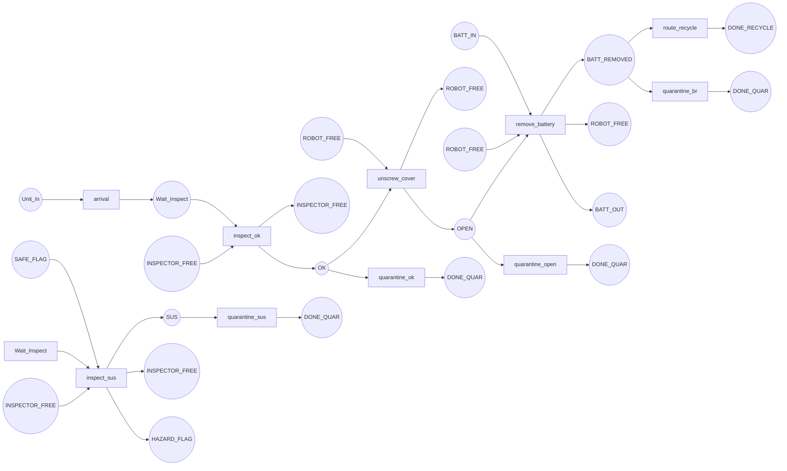

# Day 7 — Introductory Petri Nets

[← Day 6: Worked Example](day-06-worked-example-automata-supervisor.md) · [Back to overview](README.md)

## Learning objectives

1. Define Petri nets: places, transitions, arcs, tokens, markings
2. Explain why Petri nets are useful for resource contention modelling
3. Build a Petri net model of the demanufacturing cell with explicit resources
4. Define and check place invariants
5. Construct (or understand) a reachability graph for a small net
6. Compare automata and Petri net representations for the same system

## Prerequisites

- Days 1–6: DES, automata, SCT, blocking/nonblocking
- No prior Petri net knowledge required

## Core theory

### What is a Petri net?

A **Petri net** is a bipartite directed graph with two kinds of nodes — **places** (circles) and **transitions** (bars/rectangles) — connected by **arcs**. **Tokens** sit in places and flow through the net when transitions fire.

> **Definition (Murata, 1989).** A Petri net is a 4-tuple $N = (P, T, F, W)$ where:
> - $P$ = finite set of **places**
> - $T$ = finite set of **transitions** ($P \cap T = \emptyset$)
> - $F \subseteq (P \times T) \cup (T \times P)$ = set of **arcs** (flow relation)
> - $W: F \to \mathbb{N}^+$ = **weight function** on arcs (often 1)
>
> A **marking** $M: P \to \mathbb{N}_0$ assigns a non-negative number of tokens to each place. The pair $(N, M_0)$ is a **marked Petri net** with initial marking $M_0$.
>
> — Murata, [*Petri Nets: Properties, Analysis and Applications*](https://people.disim.univaq.it/adimarco/teaching/bioinfo15/paper.pdf), Proc. IEEE, 1989, §II.

### Firing rule

A transition $t$ is **enabled** at marking $M$ if every input place has at least as many tokens as the arc weight requires:

$$\forall p \in {}^{\bullet}t:\; M(p) \geq W(p, t)$$

When $t$ fires, it **consumes** tokens from input places and **produces** tokens in output places:

$$M'(p) = M(p) - W(p, t) + W(t, p)$$

### Why Petri nets for demanufacturing?

| Automata strength | Petri net strength |
|---|---|
| Clear state-event-transition structure | Natural modelling of **resource contention** (robot, station, fixture) |
| Direct mapping to SCT framework | **Concurrency**: multiple independent activities modelled without state explosion |
| Language-based analysis | **Token conservation**: place invariants give structural safety guarantees |
| Good for control logic | Good for **resource allocation** and **flow** modelling |

In a demanufacturing cell, shared resources (robot arm, inspection station) create contention: only one unit can use the robot at a time. Petri nets model this by requiring a "resource token" to fire relevant transitions.

> **Source.** The complementary roles of automata and Petri nets for DES are discussed in Cassandras, [*Discrete Event Systems*](https://eolss.net/Sample-Chapters/C18/E6-43-27-00.pdf), EOLSS, §3–4, and in Raisch, [*DES and Hybrid Systems*](https://www.hamilton.ie/ollie/Downloads/Hyb.pdf), Ch. 2 (pp. 12–22).

## Worked example: demanufacturing cell as a Petri net

### Places

| Category | Place | Meaning | Initial tokens |
|----------|-------|---------|:-:|
| **Flow** | `Unit_In` | Unit has entered the cell | 1 |
| **Flow** | `Wait_Inspect` | Unit waiting for inspection | 0 |
| **Flow** | `OK` | Inspection passed (safe) | 0 |
| **Flow** | `SUS` | Inspection flagged suspect | 0 |
| **Flow** | `OPEN` | Unit has been opened | 0 |
| **Flow** | `BATT_REMOVED` | Battery removed | 0 |
| **Flow** | `DONE_RECYCLE` | Recycling complete | 0 |
| **Flow** | `DONE_QUAR` | Quarantine complete | 0 |
| **Resource** | `INSPECTOR_FREE` | Inspection station available | 1 |
| **Resource** | `ROBOT_FREE` | Robot arm available | 1 |
| **Status** | `SAFE_FLAG` | Unit flagged safe | 1 |
| **Status** | `HAZARD_FLAG` | Unit flagged hazardous | 0 |
| **Status** | `BATT_IN` | Battery present in unit | 1 |
| **Status** | `BATT_OUT` | Battery removed from unit | 0 |

### Transitions

| Transition | Input places | Output places | Controllable? |
|-----------|-------------|---------------|:---:|
| `arrival` | `Unit_In` | `Wait_Inspect` | No |
| `inspect_ok` | `Wait_Inspect`, `INSPECTOR_FREE` | `OK`, `INSPECTOR_FREE` | No |
| `inspect_sus` | `Wait_Inspect`, `INSPECTOR_FREE`, `SAFE_FLAG` | `SUS`, `INSPECTOR_FREE`, `HAZARD_FLAG` | No |
| `unscrew_cover` | `OK`, `ROBOT_FREE`, `SAFE_FLAG` | `OPEN`, `ROBOT_FREE`, `SAFE_FLAG` | Yes |
| `remove_battery` | `OPEN`, `ROBOT_FREE`, `BATT_IN` | `BATT_REMOVED`, `ROBOT_FREE`, `BATT_OUT` | Yes |
| `route_recycle` | `BATT_REMOVED` | `DONE_RECYCLE` | Yes |
| `route_quarantine_ok` | `OK` | `DONE_QUAR` | Yes |
| `route_quarantine_sus` | `SUS` | `DONE_QUAR` | Yes |
| `route_quarantine_open` | `OPEN` | `DONE_QUAR` | Yes |
| `route_quarantine_br` | `BATT_REMOVED` | `DONE_QUAR` | Yes |

### Unsafe transitions (disabled by supervisor)

| Transition | Input places | Output places | Why disabled |
|-----------|-------------|---------------|-------------|
| `unscrew_hazard` | `SUS`, `ROBOT_FREE`, `HAZARD_FLAG` | `OPEN`, `ROBOT_FREE`, `HAZARD_FLAG` | S1: must not open suspect unit |
| `recycle_direct` | `OK` | `DONE_RECYCLE` | S2: battery not removed |

> These transitions exist in the *unsupervised plant net* but are disabled by the supervisor. This is the Petri net equivalent of the supervisor rule table from [Day 6](day-06-worked-example-automata-supervisor.md).

### Net structure diagram

> **Note:** Mermaid flowcharts approximate Petri net structure. For formal analysis, use a proper Petri net tool like [PIPE2](https://pipe2.sourceforge.net/) or [TINA](https://projects.laas.fr/tina/download.php). See the [interactive Petri net demo](../../interactive/week1/petri_net_demo.py) for a graphical rendering.

### Initial marking $M_0$

$$M_0 = (\text{Unit\_In}: 1,\; \text{INSPECTOR\_FREE}: 1,\; \text{ROBOT\_FREE}: 1,\; \text{SAFE\_FLAG}: 1,\; \text{BATT\_IN}: 1,\; \text{all others}: 0)$$

## Place invariants

Place invariants are **structural conservation laws**: weighted sums of tokens over certain places that remain constant across all reachable markings.

> **Definition.** A place invariant is a vector $y \geq 0$ such that $y^T \cdot C = 0$ where $C$ is the incidence matrix. Then $y^T \cdot M = y^T \cdot M_0$ for all reachable markings $M$.
>
> — Murata (1989), [§IV.B](https://people.disim.univaq.it/adimarco/teaching/bioinfo15/paper.pdf).

### Invariants for the demanufacturing net

| Invariant | Formula | Interpretation |
|-----------|---------|---------------|
| **Resource conservation (inspector)** | `INSPECTOR_FREE` = 1 | Inspector is always available (acquired and released within each inspection transition) |
| **Resource conservation (robot)** | `ROBOT_FREE` = 1 | Robot is always available (acquired and released within each unscrew/remove transition) |
| **Hazard boolean** | `SAFE_FLAG + HAZARD_FLAG = 1` | Exactly one hazard status is active |
| **Battery boolean** | `BATT_IN + BATT_OUT = 1` | Battery is either present or removed, never both or neither |

> **Derived explanation.** These invariants are simple but powerful: they guarantee structural properties of the model regardless of which trace is executed. If you accidentally omitted a "release resource" arc, the invariant would fail — catching the modelling error.

## Reachability

### Reachability graph concept

The **reachability graph** has markings as nodes and enabled transitions as edges. For the supervised net (with `unscrew_hazard` and `recycle_direct` disabled), key reachable markings include:

| Marking (abbreviated) | Reached via |
|----------------------|------------|
| `{Unit_In=1, ...}` | Initial |
| `{Wait_Inspect=1, ...}` | `arrival` |
| `{OK=1, ...}` | `inspect_ok` |
| `{SUS=1, HAZARD_FLAG=1, ...}` | `inspect_sus` |
| `{OPEN=1, ...}` | `unscrew_cover` |
| `{BATT_REMOVED=1, BATT_OUT=1, ...}` | `remove_battery` |
| `{DONE_RECYCLE=1, ...}` | `route_recycle` |
| `{DONE_QUAR=1, ...}` | various quarantine transitions |

### Safety under supervision

| Scenario | Unsupervised net | Supervised net |
|----------|:---:|:---:|
| `OPEN` with `HAZARD_FLAG` = 1 | ⚠️ Reachable | ✅ Not reachable |
| `DONE_RECYCLE` with `BATT_IN` = 1 | ⚠️ Reachable | ✅ Not reachable |
| `DONE_QUAR` after suspect | ✅ Reachable | ✅ Reachable |
| `DONE_RECYCLE` after `remove_battery` | ✅ Reachable | ✅ Reachable |

## Automata vs Petri nets: comparison

| Aspect | Automaton model (Day 6) | Petri net model (Day 7) |
|--------|------------------------|------------------------|
| **State representation** | Explicit states (8) | Implicit via markings (token distributions over 14 places) |
| **Resources** | Not explicitly modelled | Explicit resource places (ROBOT_FREE, INSPECTOR_FREE) |
| **Concurrency** | Hard to represent (state explosion) | Natural via independent token flows |
| **Supervisor** | Enabling function per state | Transition-disabling policy |
| **Analysis** | Language-based, reachability graph | Reachability graph + structural invariants |
| **SCT integration** | Direct (plant/spec automata → supcon) | Indirect (may need translation or dedicated tools) |
| **Best for** | Control logic, SCT synthesis | Resource allocation, flow modelling, concurrency |

## Connection to the PhD proposal

Petri nets complement automata in the proposal architecture:

- **Resource contention** in the physical cell (robot, fixtures, stations) maps naturally to resource places
- **Place invariants** provide structural guarantees that can be checked without full state-space enumeration
- When the model scales up (multiple units, more stations), Petri nets avoid the **state explosion** that automata suffer from
- The **digital twin** event log can be seen as a trace through the Petri net's reachability graph
- **Concurrent operations** (e.g., two units being processed simultaneously) are straightforward in Petri nets

## Recap

| Concept | Key point |
|---------|-----------|
| Petri net | Bipartite graph: places + transitions, connected by arcs |
| Marking | Token distribution over places — represents state |
| Firing rule | Transition fires if all input places have sufficient tokens |
| Place invariant | Weighted token sum that stays constant — structural guarantee |
| Reachability graph | All markings reachable from $M_0$ via enabled transitions |
| Resources | Modelled as token-limited places (acquire/release pattern) |
| vs Automata | PN better for resources/concurrency; automata better for SCT synthesis |

## Exercises

1. Draw the reachability graph (by hand) for the supervised net above, starting from $M_0$. How many distinct markings do you reach?
2. Add a second unit entering the cell (put 2 tokens in `Unit_In` initially). What changes? Can both units use the robot simultaneously? What does the `ROBOT_FREE` invariant guarantee?
3. Verify the battery boolean invariant: trace through each transition and check that `BATT_IN + BATT_OUT = 1` holds.

*These are self-check discussion questions. For a related graded exercise with full solution, see [Exercise 7](exercises.md).*

## Tools for Petri net modelling

| Tool | Best for | Link |
|------|---------|------|
| **PIPE2** | Visual editing + reachability graph generation | [pipe2.sourceforge.net](https://pipe2.sourceforge.net/) |
| **TINA** | State-space construction, time extensions | [projects.laas.fr/tina](https://projects.laas.fr/tina/download.php) |
| **Snoopy** | Hierarchical nets, scaling up | [GitHub](https://github.com/PetriNuts/snoopy) |
| **WoPeD** | Workflow nets, PNML interchange | [woped.dhbw-karlsruhe.de](https://woped.dhbw-karlsruhe.de/) |
| **CPN IDE** | Coloured Petri nets | [cpnide.org](https://cpnide.org/) |

Also see the [interactive Petri net demo](../../interactive/week1/petri_net_demo.py) for a programmatic visualization.

## Sources

| Source | What it provides for this day |
|--------|-------------------------------|
| Murata, [*Petri Nets: Properties, Analysis and Applications*](https://people.disim.univaq.it/adimarco/teaching/bioinfo15/paper.pdf), 1989 | Comprehensive PN tutorial: definition, firing, invariants, reachability |
| Raisch, [*DES and Hybrid Systems*](https://www.hamilton.ie/ollie/Downloads/Hyb.pdf), §2.2–2.4 (pp. 12–22) | PN definition, reachability, reachability graph |
| Cassandras, [*Discrete Event Systems*](https://eolss.net/Sample-Chapters/C18/E6-43-27-00.pdf), EOLSS, §3–4 | DES modelling overview including Petri nets |
| Esparza, [*Petri net lecture notes*](https://www.cse.iitb.ac.in/~akshayss/courses/cs735/Esparza-lecture-notes.pdf) | Reachability graph algorithm, liveness theorem |
| Geeraerts, [*Petri net tutorial*](https://verif.ulb.be/ggeeraer/Tutorial-Perti-Nets-Geeraerts.pdf) | Reachability trees, place invariants, coverability |

---

[← Day 6: Worked Example](day-06-worked-example-automata-supervisor.md) · [Back to overview](README.md)
