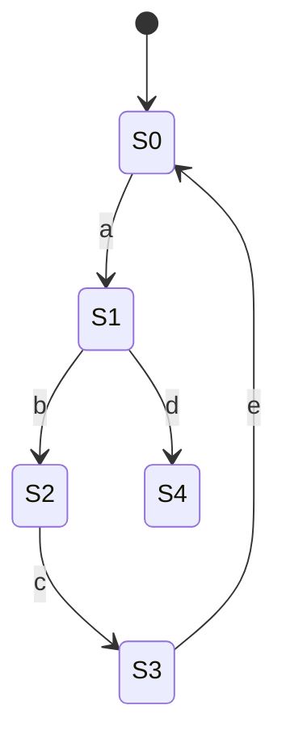

# Exercises — Week 1

[← Back to Week 1 overview](README.md) · [Solutions](exercise-solutions.md)

These exercises consolidate Week 1 concepts. Each is tagged with the relevant day(s) and produces a concrete artefact.

---

## Exercise 1 — Event taxonomy (Day 1)

**Goal:** Translate a physical system into a DES event alphabet.

Imagine a demanufacturing cell that processes smartphones. The cell has:
- A conveyor intake
- An automated X-ray inspection station
- A robotic disassembly arm
- A chemical bath for battery neutralisation
- Two output bins (recycling, hazardous waste)

**Tasks:**
1. List at least 12 events for this cell.
2. For each event, classify:
   - Controllable or uncontrollable?
   - Observable or unobservable?
   - Source (sensor, actuator, human, MES)?
3. Identify at least 3 safety-critical events and explain why they are critical.

---

## Exercise 2 — Plant automaton (Days 1–2)

**Goal:** Build a formal automaton model.

Using the demanufacturing cell from the running example (laptop intake → inspection → open/battery → recycle/quarantine):

1. Write the formal tuple $G = (Q, \Sigma, \delta, q_0, Q_m)$.
2. Draw the state diagram (use Mermaid syntax or hand-draw).
3. List 5 example traces. For each, state:
   - Is it in $L(G)$?
   - Is it in $L_m(G)$?
   - Is it safe?
4. Add a `fault` event (uncontrollable) that can occur from `Opened`, leading to a new `Faulted` state. Is `Faulted` a marked state? Why or why not?

---

## Exercise 3 — Safety specifications (Day 3)

**Goal:** Move from intuition to formal safety requirements.

For the plant automaton from Exercise 2 (with the `fault` extension):

1. Write at least 3 safety rules as forbidden state/string pairs. State each as:
   - Informal requirement (one sentence)
   - Formal forbidden condition (which states or transitions are forbidden)
2. For one safety rule, construct a **specification automaton** $E$ that generates only legal behaviour.
3. Explain why each forbidden transition involves a **controllable** event (and what happens if it does not).

---

## Exercise 4 — Controllable vs uncontrollable classification (Day 4)

**Goal:** Practice the controllability partition and verify the controllability condition.

Given the following events for a generic manufacturing cell:

| Event | Description |
|-------|-------------|
| `start_drill` | Command to start drilling |
| `drill_done` | Drill operation completed (sensor) |
| `part_arrive` | Part arrives on conveyor (sensor) |
| `clamp_part` | Command to clamp the part |
| `clamp_fail` | Clamp mechanism fails (sensor) |
| `release_part` | Command to release the clamp |
| `move_to_output` | Command to move part to output |
| `operator_override` | Human operator takes manual control |

1. Classify each event as controllable or uncontrollable. Justify each choice.
2. Write a simple plant automaton (4–5 states) for this cell.
3. Define one safety rule and verify the **controllability condition**: for every legal prefix, if an uncontrollable event is plant-possible, is the result still legal?

---

## Exercise 5 — Blocking / nonblocking check (Day 5)

**Goal:** Identify blocking states and verify nonblocking.

Consider the following automaton:

Marked states: $Q_m = \{S0, S3\}$

1. List all reachable states.
2. List all coreachable states (can reach a marked state).
3. Is the automaton nonblocking? If not, identify the blocking state(s).
4. Is the blocking a deadlock or a livelock?
5. Suggest a minimal change that makes the automaton nonblocking.

---

## Exercise 6 — Supervisor design (Days 3, 5, 6)

**Goal:** Build a complete supervisor for a small example.

Use the demanufacturing cell plant from [Day 6](day-06-worked-example-automata-supervisor.md). Now add these requirements:

- **S1** (hazard rule): suspect units must not be opened or recycled — *already in the model*
- **S2** (battery rule): no recycling without battery removal — *already in the model*
- **S3** (new): once a unit is opened, it must **not** be quarantined directly — it must have its battery removed first (either for safe disposal or inspection)

**Tasks:**
1. Update the supervisor rule table to include S3.
2. Draw the new supervised state diagram.
3. Verify controllability (no uncontrollable events blocked).
4. Verify nonblocking (every reachable state can reach a marked state).
5. Enumerate all safe traces in the new supervised system.

---

## Exercise 7 — Basic Petri net (Day 7)

**Goal:** Build a Petri net and check invariants.

Model a simple 3-station manufacturing cell:
- Station A (drilling): requires a drill (shared resource, only 1 available)
- Station B (washing): independent, no shared resource
- Station C (packaging): requires a packing robot (shared, only 1)

A part flows: Station A → Station B → Station C → Done.

**Tasks:**
1. Define places, transitions, and arcs.
2. Define the initial marking $M_0$.
3. Identify and write down at least 2 place invariants.
4. Trace the execution: fire transitions one at a time, recording the marking after each step.
5. Can two parts be processed simultaneously? If so, where can contention occur? What does the invariant guarantee?

---

## Exercise 8 — Integrative modelling exercise (all days)

**Goal:** Build a complete DES model from a new scenario.

You are given a small e-waste cell with:
- **Intake** conveyor
- **Weighing** station (automated)
- **Manual sorting** station (human)
- **Shredder** (automated)
- **Output bin** (recycling) and **rejection bin** (non-recyclable)

Rules:
- Units over 5 kg must be manually sorted before shredding
- Units under 5 kg may go directly to shredding
- The shredder must not operate while the manual sorting station is occupied
- Rejected units must not enter the shredder

**Tasks:**
1. Define the event alphabet with classifications
2. Build the plant automaton
3. Define safety specifications
4. Build the supervisor rule table
5. Verify nonblocking
6. (Bonus) Model the same system as a Petri net with a shared "shredder" resource

---

[← Back to Week 1 overview](README.md) · [Solutions](exercise-solutions.md)
